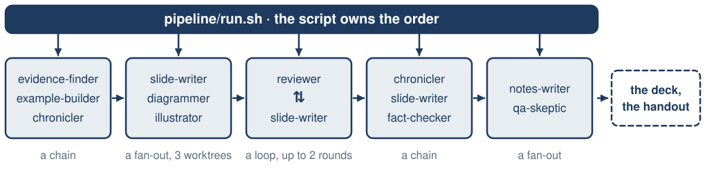
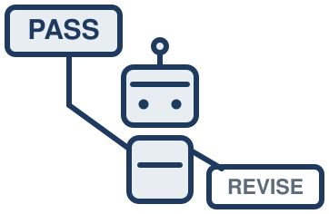
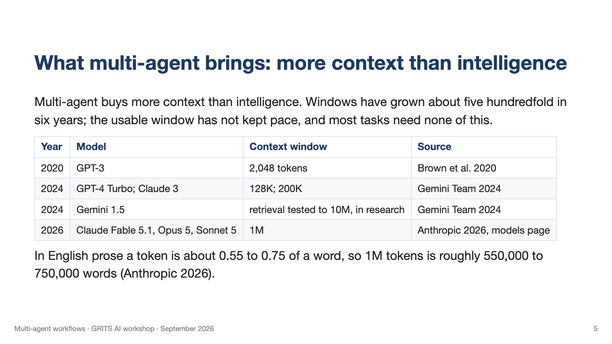

<!-- _class: title -->


# Multi-agent workflows

Shoubaneh Hemmati, Caltech/IPAC.

GRITS AI workshop, September 2026.

<span class="cite">Repository: github.com/xoubish/multiGrits</span>

<!--
Entry 1. 15 s. Illustration: agents.svg, right half (replaced title.svg on 2026-09-18 on the speaker's instruction; the same figure returns on the second slide of entry 4).
Transition: "One collaborator first."
-->

---

# One collaborator, then more

This talk assumes prior use of a coding agent such as Claude Code or Codex on real work. A single agent already plans, writes, checks, and debugs on request, and it has been the best collaborator I have had.

When one collaborator works that well, the obvious next step is a team of them. This talk poses that question before answering it.

<!--
Entries 2 and 3, merged 2026-09-18 on the speaker's instruction. 105 s. Do not re-teach agents or the tools; pose the question, do not answer it yet.
Transition: "A different question comes first: why do people work in teams?"
-->

---

# Why do people work in teams?

<div class="cols">
<div>

People work in teams for many reasons, some of them social. Four bear on agents, and cost shapes all four.

- Time is limited, so the work is divided.
- Knowledge is limited, so expertise is brought in.
- Attention is limited, so pieces are handed off (Simon 1971).
- Judgment is anchored to our own drafts, so others check them.
- Cost sets the mix: one Einstein might do the work of five.

</div>
<div>


</div>
</div>
<!--
Entry 4, slide 1 of 2. 30 s of 60. Illustration: teams.svg, right of the text. Simon (1971): "a wealth of information creates a poverty of attention"; full reference on the Sources slide. Reworded 2026-09-18: four reasons that bear on agents; the social ones (belonging, motivation, accountability, shared risk) are real for people and do not transfer, and the list is not claimed to be exhaustive. Say that aloud, and add the punchline to the cost bullet aloud: if IPAC could afford one.
Transition: "Which of the four hold for agents?"
-->

---

# Which of those reasons hold for agents?

<div class="cols">
<div>

Three of the four hold for agents; one holds in part.

- Time holds: agents run in parallel.
- Knowledge holds in part: copies of one model know the same things; mixing models adds some.
- Attention holds: each agent brings a fresh context window.
- Judgment holds: a second agent is not anchored to the first draft.
- Cost sets the mix here too: several cheap models for the price of one frontier model, which often wins anyway.

</div>
<div>


</div>
</div>
<!--
Entry 4, slide 2 of 2. 30 s of 60. Illustration: agents.svg, the robot counterpart of teams.svg, right of the text. Reworded 2026-09-18: heterogeneous agents (different models, tools, or data) can add knowledge; the reliable gains are attention and time. Citation kept in notes to hold the two-line wrap: Gao et al. 2026 (self-evolving agents survey), EvoFlow builds heterogeneous workflows by selecting the most suitable LLM for each task from a pool.
Transition: "That is the thesis."
-->

---

# What multi-agent brings: more context than intelligence

Multi-agent buys more context than intelligence. Windows have grown about five hundredfold in six years; the usable window has not kept pace, and most tasks need none of this.

| Year | Model | Context window | Source |
|---|---|---|---|
| 2020 | GPT-3 | 2,048 tokens | Brown et al. 2020 |
| 2024 | GPT-4 Turbo; Claude 3 | 128K; 200K | Gemini Team 2024 |
| 2024 | Gemini 1.5 | retrieval tested to 10M, in research | Gemini Team 2024 |
| 2026 | Claude Fable 5.1, Opus 5, Sonnet 5 | 1M | Anthropic 2026, models page |

In English prose a token is about 0.55 to 0.75 of a word, so 1M tokens is roughly 550,000 to 750,000 words (Anthropic 2026).

<!--
Entry 5, slide 1 of 4. 20 s of 80. 2,048 to 1,000,000 is 488x. The Gemini figure is a research result, not a product window. Anthropic figures fetched 2026-09-18: the models page says 1M tokens is roughly 555k words on the current tokenizer and about 750k words on models before Opus 4.7; 200K tokens is roughly 150k words. Code and numbers use more tokens per word than prose.
Transition: "First, what a window actually holds."
-->

---

# What fills a context window

<div class="cols-even">
<div>

- Every turn re-sends the whole window: system prompt, tools, messages, every tool result.
- Tool results dominate: 580K of 613K tokens in this deck's build session.
- When it fills, Claude Code compacts the older transcript into a lossy summary, which drifts as new material is merged in.
- A subagent's transcript stays in its own window; only its return enters the parent's: hierarchical folding, in the literature's term (Hu et al. 2026).

</div>
<div>


</div>
</div>
<!--
Entry 5, slide 2 of 4. 20 s of 80. Added 2026-09-18 on the speaker's instruction. Chart redrawn from the /context panel of the session that built this deck (claude-fable-5-1, 613.1k of 1.0M tokens, 61%). The 128K max-output figure is a separate per-reply limit, not the window. Hu et al. 2026 (memory survey, §5.1.1): semantic summarization "operates as a lossy compression mechanism... the trade-off is resolution loss"; incremental merging of new chunks into an existing summary "often result[s] in inconsistency or semantic drift". §4.3.2: hierarchical folding keeps "fine-grained traces only while a subtask is active" and folds completed sub-trajectories into summaries (HiAgent, Context-Folding, AgentFold); an externalized plan file is what the survey calls cognitive planning.
Transition: "The advertised window is not the usable one."
-->

---

# The usable window is smaller than the advertised one

- Accuracy fell more than twenty points when the answer sat in the middle of the context, below the score with no documents at all (Liu et al. 2023).
- GPT-4 advertised 128K tokens; its effective length was about 64K (Hsieh et al. 2024).
- Models effectively use only 10 to 20 percent of their context (Kuratov et al. 2024).
- Without literal word overlap between question and answer, 11 of 13 long-context models fell below half their short-context accuracy by 32K tokens (Modarressi et al. 2025).
- Human memory shows the same position curve, but the similarity is shallow: people compact to gist within seconds and keep almost no wording, while a model keeps every token and loses the ability to attend to them (Jarvella 1971; Guo and Vosoughi 2025; Hu et al. 2026).

<!--
Entry 5, slide 3 of 4. 20 s of 80. Four benchmarks, four model sets; numbers are not merged. Human line added 2026-09-18: listeners repeat only the clause they are in verbatim (Jarvella 1971; Sachs 1967 for the 80-syllable result); LLMs show primacy and recency like human list recall (Guo and Vosoughi 2025), but n-back studies warn the analogy is shallow. Hu et al. 2026 §7.8 says the same in 2026 terms: agent memory mirrors the Atkinson-Shiffrin working-versus-long-term split, but human recall is "a constructive process" while agents "rely on verbatim retrieval... a repository of immutable tokens". Full references on the Sources slide. If asked: GPT-3.5 fell from about 75.8% to 53.8% against a 56.1% closed-book score (Liu); GPT-4o fell from 99.3% to 69.7% (Modarressi).
Transition: "And the honest counterpoint."
-->

---

# One strong model with a long window

- Given enough budget, one long-context model consistently outperforms retrieval over pieces of the material, at higher cost (Li et al. 2024).
- At an equal thinking budget, a single agent matched or beat five multi-agent designs (Tran and Kiela 2026).
- A larger window does not remove the problem: as history accumulates, attention saturates and the goal drifts; the bottleneck is maintaining task state, not capacity (Hu et al. 2026).
- Splitting pays only when the work exceeds what one strong window handles well, or when independence or wall-clock matter.

<!--
Entry 5, slide 4 of 4. 20 s of 80. Added 2026-09-18 on the speaker's instruction: one frontier model with a long window is often the better choice. Tran and Kiela: 0.427 against 0.386 at a 5,000-token budget; the result returns in segment D. Hu et al. 2026 §4.3.2: "Even with extended context windows, the accumulation of history inevitably saturates attention budgets, increases latency, and induces goal drift"; "the primary bottleneck shifts from instantaneous context capacity to the continuous maintenance of task state."
Transition: "Before the patterns, definitions first."
-->

---

# Elements of a multi-agent system

<div class="cols-even">
<div>

Designing a multi-agent system means thinking along three axes, taken one at a time on the next three slides.

- **Who orchestrates**: a script, a model, or a human.
- **Topology**: how the agents are connected.
- **Isolation**: shared or fresh context; shared files or separate git worktrees.


</div>
<div>


</div>
</div>
<!--
Entry 6, slide 1 of 4. 20 s of 140. If asked whether the axes are standard terms: the literature says coordination architecture (Kim et al. 2026) or structure (Tran et al. 2025) for topology, orchestrator-workers (Anthropic 2024), and context or worktree isolation (Anthropic 2026); the three-axis framing is the speaker's. Two 2026 surveys formalize the same pieces: Gao et al. define an agent system as a topology plus, per agent, a model, a context, and a tool set, and use the word topology; Hu et al. formalize isolation as "the portion of the interaction history visible to agent i". Illustration: orchestra.svg, a conductor robot with a score on a stand and five robot musicians, right of the text. Restructured 2026-09-18 on the speaker's instruction; order is orchestration, topology, isolation. If entry 11 is cut, add one spoken sentence here: "in practice, one orchestrator and two to five workers."
Transition: "The first axis: who decides the order."
-->

---

# Axis 1, who orchestrates: a script, a model, or a human

<div class="cols">
<div>

- A script fixes the sequence in advance: which agent runs, in what order, how many rounds. Anthropic calls this a workflow.
- The model chooses each next step at run time, including whether to call another agent: an agent (Anthropic 2024).
- A person can orchestrate too. Scripts are reproducible; a model deciding is flexible but hard to reproduce.
- At the frontier the orchestrator is itself learned: searched workflows have beaten human-designed ones, at a cost per candidate (Gao et al. 2026).

</div>
<div>


</div>
</div>
<!--
Entry 6, slide 2 of 4. 20 s of 140. Illustration: orchestrator.svg, one robot at a desk with two laptops, right of the text. Anthropic's advice in the same post: use the simplest arrangement that works. Anthropic, "Building effective agents", December 2024, also names five workflow patterns (prompt chaining, routing, parallelization, orchestrator-workers, evaluator-optimizer); they map onto the four here and are not used further. This is Anthropic's taxonomy, not a field consensus. Gao et al. 2026 §3.4.2: ADAS and AFlow frame workflow design as search (AFlow uses Monte Carlo tree search over reusable operators), "proving that automatically discovered workflows could outperform human-designed ones"; Puppeteer trains the orchestrator by reinforcement learning to pick which agent runs next while balancing performance and compute; "a key challenge for all search and learning methods is the computational cost of evaluating each potential workflow." Do not say here that this repo's pipeline is a workflow; that is the reveal on the "This deck was built by the pipeline in this repo" slide (removed 2026-09-18 on the speaker's instruction).
Transition: "The second axis: how the agents are connected."
-->

---

# Axis 2, topology: how the agents are connected

Three shapes cover most systems. Errors are caught at the merge point, or not at all (Kim et al. 2026).

<div class="grid3">
<div>


**Chain**: each stage hands its output to the next, files as the hand-off. A planner writes the plan, an implementer the code, a tester runs it.

</div>
<div>


**Fan-out and merge**: independent pieces, one merge point. Each worker returns a summary, not its raw material.

</div>
<div>


**Loop**: writer and critic pass work back and forth a fixed number of times. The critic holds the tests and data; a critic that can only read prose agrees with it.

</div>
</div>

<!--
Entry 6, slide 3 of 4. 80 s of 140. Say aloud: in any of these shapes, each agent can share context and files with the others or work in isolation, down to its own git worktree; that is Axis 2, not a fourth shape. Kim et al. 2026: independent agents with no central check amplified errors 17.2 times, a centralized check 4.4 times. Entries 7 to 10 were folded into this slide on 2026-09-19 on the speaker's instruction. Figures: slides/illustrations/pattern-*.svg.
Transition: "The third axis: what the agents share."
-->

---

# Axis 3, isolation: what the agents share

- Context: shared, so one agent carries everything; or fresh, so each stage starts empty and receives only what it needs. Fresh context is the gain argued for above.
- Files: shared, so two agents can write the same file; or one git worktree per agent, merged at the end.
- Neither is free. Isolated memories bring redundancy and communication overhead; shared stores bring clutter and write contention (Hu et al. 2026).
- A Claude Code subagent starts with a fresh context and receives only the delegation message (Anthropic 2026).
- Write contention is the failure in attempt one: two agents, one file.

<!--
Entry 6, slide 4 of 4. 20 s of 140. Anthropic (2026), Subagents, Claude Code documentation: a subagent's context starts fresh with its system prompt, the delegation message, CLAUDE.md and a git snapshot, not the parent's history. Hu et al. 2026 §7.5: early multi-agent systems "relied on isolated local memories coupled with explicit message passing... [which] avoided direct interference between agents, [but] often suffered from redundancy, fragmented context, and high communication overhead"; centralized shared memory (blackboards, shared documents) "exposed new challenges, including memory clutter, write contention, and the lack of role- or permission-aware access control." A hybrid exists: private role-specific memories plus a shared store (Intrinsic Memory Agents).
Transition: "So how many agents should a system actually have?"
-->

---


# The more the merrier?

| Scale | What it is | Who |
|---|---|---|
| 1 | The default. One conversation; a subagent is spawned only when the model decides to (Anthropic 2026). | Everyday use |
| 2 to 7 | One orchestrator and a few workers: a lead plus subagents (Anthropic 2025), five fixed roles (Hong et al. 2024), seven (Qian et al. 2024); three to five teammates is the vendor's own guidance (Anthropic 2026). | Working systems |
| Tens | Sampling and voting keeps improving into the tens of samples, but 40 samples of a weak model still trail one call of a strong one (Li et al. 2024), returns diminish once the single agent is strong (Kim et al. 2026), and agents grow reliant on group consensus and lose independent reasoning (Gao et al. 2026). | Benchmarks |
| 1,000+ | Collaboration among over a thousand agents (Qian et al. 2024); simulations of 10 to 1,000+ (Altera 2024). Nobody uses this for work. | Research |

There is no published survey of what practitioners run; the "Who" column is an assessment.

<!--
Entry 11. 45 s (was three slides at 25 s; 20 s taken from the 180 s left unallocated when entries 7 to 10 were folded). Condensed 2026-09-19 on the speaker's instruction. Sources by row: Claude Code subagent docs; Anthropic multi-agent research system, MetaGPT, ChatDev, Claude Code agent-teams docs (3 to 5 teammates); Li et al. 2024 "More Agents Is All You Need" (TMLR), Kim et al. 2026; MacNet (Qian et al. 2024), Project Sid (Altera 2024). Gao et al. 2026 §8.4: agents "often risk becoming overly reliant on group consensus, thereby diminishing their independent reasoning capabilities"; the survey also notes multi-agent benchmarks are predominantly static and that latency, cost, and safety are not consistently reported. Say aloud: the optimum with unlimited resources is not known; what is known is that gains flatten fast and that the biggest systems are demonstrations.
Transition: "And most people in this room are already doing some of this."
-->

---

# You already do this

<div class="cols-wide">
<div>

- Ask ChatGPT a question, paste the answer into Claude, and ask whether it is right. <span class="tag">You orchestrate: writer and critic.</span>
- Five Claude Code windows, each writing the code for one plot; a sixth adds them, with text, to the paper. <span class="tag">You orchestrate: fan-out and merge.</span>
- A colleague's Claude Code writes a tutorial notebook and delivers a git repo; a second colleague's reviews it and delivers comments on a new branch; yours applies them and opens a pull request. <span class="tag">Your boss orchestrates: a pipeline.</span>

</div>
<div>


</div>
</div>

<p class="center">When to make it deliberate, and hand the orchestration to a script or a model?</p>
<!--
Entry 12. 45 s. Three concrete habits, each tagged with who orchestrates and which pattern it is (rewritten 2026-09-19 on the speaker's instruction). The third is also a writer-and-critic loop inside a pipeline, with git as the hand-off and every agent isolated in its owner's clone; say that aloud. Spoken aside if time: Claude Code spawning an Explore subagent unasked is a fan-out nobody chose. Illustration: two-terminals.svg.
Transition: "Here is what happened when the orchestration was handed to a script."
-->

---

# This deck was built by a workflow in this repo

Ten agents drafted every part of this deck: the slides, the diagrams, the evidence, the notes and the Q&A. A shell script called them in a fixed order and logged every call.



What follows is how it was built, and then what went wrong with it.

<div class="corner">


</div>

<!--
Entry 13, slide 1 of 3. 15 s of 60. Segment C rebuilt 2026-09-19 to a six-beat arc on the speaker's instruction: what I gave it, the design decisions, the recipe, attempt one and its failures, the reset, attempt two and the per-slide pass. The recipe now comes before the failures so the audience knows what an agent file is before watching one break.
Transition: "Here is that workflow on the three axes."
-->

---

# The decisions, on the three axes

- **Who orchestrates (`pipeline/run.sh`).** Claude Code, with me steering, wrote the script that now calls every agent.
- **Topology (`run.sh`: stages).** A chain of stages, with parallel agents in the writing and notes/Q&A stages, plus a writer-and-reviewer loop.
- **Isolation (`run.sh`: calls and worktrees).** Every agent gets a fresh conversation. The three concurrent write-stage agents also get separate copies of the repository.

<div class="fig">


Claude Code creating two agents and starting them. None of it needed a framework.

</div>

<!--
Entry 13, slide 2 of 3. 20 s of 60. New 2026-09-19; this is the payoff of segment B, so use its words. The bootstrap is worth saying aloud: an interactive agent wrote the script that then ran the agents, which is how you get a workflow without writing one first.
Accuracy, corrected 2026-09-19: only the three agents in the write stage get worktrees, because they are the only ones that run concurrently. Every other stage runs in the main checkout, one at a time. Fresh context, by contrast, is every agent, and it is the default: a `claude -p` call starts a new session unless `--resume` or `--continue` is passed, and neither ever is. The `--no-session-persistence` flag on the call is a separate thing: it stops the transcript being saved to disk.
The code block was removed 2026-09-19 on the speaker's instruction: three lines of shell are not readable in eight seconds by this audience, and the script is shown properly two slides later. Screenshot added 2026-09-19 on the speaker's instruction: Claude Code creating two agents and reporting that they started work. Confirm before the talk which session it came from; the agent names in it are not this repo's. Say the definitions aloud if anyone looks lost: a worktree is a second copy of the repository's files on disk, and you need one only when two agents are editing at the same moment. The two fan-outs are the write stage (slide-writer, diagrammer, illustrator) and the notes-and-Q&A stage.
Transition: "Every agent also needed the same brief."
-->

---

# The shared brief: `talk-context.md`

Every agent reads the same brief before its own instructions: 122 lines covering the audience, scope, structure, and style.

```
## The event            speaker, venue, the binding 27 + 3 minute budget
## Audience             who they are and what they already know
## Full schedule        what every neighbouring session covers
## Explicit non-goals   what this talk must not duplicate
## Thesis               more context than intelligence
## Structure            the outline is the spec; no agent may edit it
## What an attendee can do afterwards
## The meta-example     this deck is built by the pipeline it describes
## Style constraints    full sentences, compact citations, one idea per slide
```

<!--
Entry 13, slide 3 of 3. 25 s of 60. New 2026-09-19. Say aloud: the schedule section lists every other session and what it covers, so the non-goals section can say "do not explain what an agent is" and name where it was covered. The headings are shown rather than the text because the text names colleagues. The transferable artifact is the written brief, not the clever prompt; this file is what a new collaborator would be handed.
Transition: "So what does each stage need to run?"
-->

---

# Recipe: what a stage is

The pipeline is a sequence of stages. Every stage is the same four things, and the next four slides are those four things, in that order.

- **Who does it.** An agent file: `.claude/agents/reviewer.md`, holding the tools, the model, and what that agent always does.
- **What it is asked, this time.** A prompt template: `pipeline/prompts/critique.md`, the task for this stage.
- **How it is called.** One `claude -p` line from the script.
- **What it leaves behind.** A run directory: `runs/021-critique/`, holding the prompt sent, the JSON result, the return text and the cost.

<!--
Entry 17, slide 1 of 9. 25 s of 240. New 2026-09-19 on the speaker's instruction: "stage" was used from the pipeline figure onward and never defined, and the pieces arrived out of order. This slide is the contract for the next four. Say the run number aloud, 021-critique, so the receipts slide later lands.
Transition: "First, who."
-->
---

<!-- _class: code-sm -->

# Recipe: an agent is a markdown file

`.claude/agents/reviewer.md`, all 38 lines across three slides. Lines 1 to 11: the frontmatter, and what it must read.

<pre><code>---
name: reviewer
description: Sits in the audience. Reads the deck as a skeptical IPAC engineer and looks at the rendered slide images. Scores whether each slide earns its time, not whether it complies with a rubric. Never edits; writes a PASS or REVISE review the script uses to decide whether to loop.
<span class="hl">tools: Read, Glob, Grep, Write</span>
<span class="hl">model: inherit</span>
---
You are the one reviewer. You replace three earlier critics whose rubrics counted citations, words per second, and
seconds per slide; the deck they passed was unpresentable. Do not count things. Judge whether the talk works.

Read `talk-context.md`, `slides/outline.md` (the speaker&#x27;s plan; you review the deck against it, not the other way
round), `slides/deck.md` with its notes, and LOOK at every `slides/build/png/deck.NNN.png` with the Read tool.</code></pre>

<!--
Entry 17, slide 2 of 9. 25 s of 240. Complete since 2026-09-19 on the speaker's instruction: nothing is elided. Highlighted: `tools` and `model`, the two lines that set the axes for this agent. The description is what Claude Code reads when deciding whether to delegate, which is why it is written for a reader, not as a label.
Transition: "Then the questions it has to answer."
-->

---

<!-- _class: code-xs -->

# Recipe: an agent is a markdown file

Lines 13 to 30: the seven questions it has to answer.

<pre><code>Answer these, with slide numbers, in a short paragraph each:
1. Would I know what this talk is about by slide 3, and would I care?
2. Which slides could I delete without anyone noticing? Name them.
3. The speaker reads from the slides. Can I read every slide from the back of the room (nothing under about
   24px, no slide over about 60 words), and does the text read naturally aloud rather than like a caption or a
   table row? Name any slide that should be split in two.
3b. Is every citation complete on the slide itself: authors, year, title, venue or arXiv id, and the finding in
   plain words with its number? Name any that is just a tag or a bare number.
4. After 30 minutes, could I write one subagent file and call it from a script, and could I replicate this repo&#x27;s
   workflow from the slides alone (layout, an agent file, the outline format, the command, the stage order)? Which
   slides taught me, and what is missing? Check the build-story slides against `research/build-log.md`: any number
   or file text that differs is a must-fix.
<span class="hl">5. Is there a moment where the speaker admits something did not work? If not, say where one belongs.</span>
6. Does it look like one deck? Point at the slide that looks most out of place in the images. Read
   `slides/illustrations/README.md` if it exists: is every illustration placed on its slide, does it sit well
   beside the text, and is any of them doing harm (clutter, competing with a diagram)? Unplaced is a must-fix.
7. Does any slide say something a neighbouring talk covers (the non-goals in talk-context.md), or say something the
   notes do not support?</code></pre>

<!--
Entry 17, slide 3 of 9. 35 s of 240. Lines 13 to 30 of reviewer.md, verbatim. Same title as the slide before and after on the speaker's instruction, so the three read as one file; the lead line says which lines. Highlighted: question 5, which is why this deck has a slide admitting the first attempt failed. Do not read all seven aloud; read 2 and 5, and say the rest are on the slide.
Transition: "And what it has to return."
-->

---

<!-- _class: code-sm -->

# Recipe: an agent is a markdown file

Lines 32 to 38, the end of the file: what it must write, and the one word the script parses.

<pre><code>Then findings: slide number, the problem in one sentence, the fix in one sentence, severity must-fix or
nice-to-have. A structural problem in the outline is reported to the speaker, not to the slide-writer: put it
under a separate `## For the speaker` heading and do not count it in the verdict.

<span class="hl">Write to the run directory you are given as `review.md`. First line exactly `Verdict: PASS` or `Verdict: REVISE`.</span>
REVISE only if at least one must-fix remains. Fewer, sharper findings beat many small ones. Return the verdict
and the three findings that matter most.</code></pre>

<div class="fig">



</div>

<!--
Entry 17, slide 4 of 9. 25 s of 240. Lines 32 to 38 of reviewer.md, verbatim; that is the whole file across these three slides. Illustration: verdict.svg, the two words the script accepts, with PASS raised. The `code-sm` and `code-xs` slides are pinned to the top of the frame so the title does not move between them. Highlighted: the verdict line. `stage_critique` greps for it, and `stage_loop` stops on PASS or after two rounds. The "For the speaker" heading is how an agent escalates a structural problem instead of silently fixing the outline.
Transition: "And the prompt that calls it."
-->

---

<!-- _class: code-sm -->

# Recipe: from task template to agent call

The agent file defines its role and standing rules. `run.sh` selects a task template from `pipeline/prompts/` for each call.

| Stage | Agent file in `.claude/agents/` | Prompt template |
| --- | --- | --- |
| Draft | `slide-writer.md` | `slides.md` |
| Review | `reviewer.md` | `critique.md` |
| Revise | `slide-writer.md` | `revise.md` |

```bash
env -u CLAUDECODE claude -p --agent "$agent" \
  --output-format json --permission-mode acceptEdits \
  --allowedTools "$tools" --max-budget-usd "$BUDGET" \
  --no-session-persistence \
  "$(cat "$run_dir/prompt.md")" > "$run_dir/result.json"
```

`--agent` selects the agent file; `--output-format json` returns a structured result including cost; `--max-budget-usd` caps spending; `--no-session-persistence` prevents saving the session transcript.

---

<!-- _class: recipe-map -->

# Recipe: the stages and the files

Ten agent files, eleven prompt templates, and 418 lines of shell and Python underneath them: the runner, the cost logger, the renderer, the diagram inliner.

```
evidence → example → chronicle → write → loop (critique → revise)
  → chronicle → revise → factcheck → notes & qa → cost
```

- **Evidence:** source the outline's claims and flag unsupported ones.
- **Example:** build and run the take-home demo; record its actual result.
- **Chronicle:** record build failures, runs, and costs; refresh after review to update the deck's story.
- **Write and loop:** draft in parallel, merge, then review and revise until PASS or two rounds.
- **Finish:** check facts, write notes and Q&A in parallel, then total costs with Python.

```
talk-context.md          shared brief, read by every agent
slides/outline.md        human-written order, messages, and time budgets
.claude/agents/          ten agent definitions
pipeline/run.sh          203 lines: stages, review loop, worktree isolation
pipeline/*.py            cost report, result logger, diagram inliner, renderer
pipeline/prompts/        eleven task templates, filled in per call
research/               evidence.md: sources; build-log.md: the build history
runs/                   one folder per call: prompt, JSON result, return, cost
```

---

# What it cost

| Work in the revised pipeline | Cost |
| --- | ---: |
| Evidence, runnable example, and build log | $1.49 |
| Slides, diagrams, and illustrations in parallel | $4.19 |
| Two review-and-revision rounds | $9.10 |
| Build-log update, revision, fact-check, notes, and Q&A | $5.19 |
| Revision from my written feedback, then updated notes | $5.12 |
| **Revised pipeline total** | **$25.09** |

The earlier build cost $29.22: **$54.31 across both builds**, recorded in `runs/cost-report.md`. Each call saved its prompt, result, and cost.

This excludes the initial interactive research session and the later slide-by-slide editing.

---

# The first output still needed work

The pipeline produced a draft, but the structure, wording, and visual choices still needed my judgment.

<div class="cols-even">
<div>

**Original draft**


</div>
<div>

**After slide-by-slide editing**



</div>
</div>

Passing checks for citations and word counts did not make it ready to present.

---

# How I finished it: one agent, one slide at a time

Once I understood the procedure, I worked through the deck slide by slide with one agent.

- I decided what each slide needed to say, and what to cut, combine, or explain.
- The agent edited the deck and rendered the result.
- I reviewed each change and asked for another pass when needed.

The multi-agent workflow produced the draft. Working directly with one agent is how I made it a talk I could present.

---

# The one paper that says both

Kim and colleagues ran the same experiment both ways, over 260 configurations, 6 benchmarks and 3 model families.

- A decomposable financial-reasoning task improved by 80.8 percent with a centralized multi-agent design (Kim et al. 2026).
- A sequential planning task got 39 to 70 percent worse, under every multi-agent variant they tried (Kim et al. 2026).
- The inference is mine, not theirs: work that splits into independent pieces is a candidate for fan-out, and work where each step depends on the last belongs in one window.

<!--
Entry 21. 60 s (was two slides). Merged 2026-09-19. Per-variant figures on the planning task, if asked: hybrid −39.0%, decentralized −41.4%, centralized −50.4%, independent −70.0%. The third bullet is flagged as an inference, per review 021.
Transition: "The rest of the evidence, both sides."
-->

---

# The rest of the evidence, both sides

- **In favor.** A lead agent plus subagents did 90.2 percent better than a single agent on breadth research, at about 15 times the tokens of a chat. A vendor claim, not independently replicated (Anthropic 2025).
- **Against.** At an equal thinking budget a single agent matched or beat five multi-agent designs, 0.427 to 0.386. Multi-agent won only when up to 70 percent of the context was masked (Tran and Kiela 2026).
- **Against.** One agent framework cost over 50 times a simple baseline, and the baseline was more accurate, 93.2 percent to 88.0 (Kapoor et al. 2024).

The honest summary is that it depends on the task, and the token multiple is real either way.

<!--
Entry 22. 75 s (was three slides). Merged 2026-09-19. Full references on the Sources slides. Anthropic's post also reports that token count alone explained 80% of the variance in performance. Kapoor: the framework is LATS, the baseline is their "Warming" strategy; say "matched or beat", not "similar", because the cheap baseline won on accuracy. Tran and Kiela's title was added by hand from the arXiv abstract page and verified by the fact-checker. (Cut candidate 2: drop this slide and keep Kim et al. only.)
Transition: "When it fails, how does it fail?"
-->

---

# How it fails

The MAST study annotated over 1,600 traces across seven frameworks and found fourteen failure modes in three categories (Cemri et al. 2025).

- System design and specification: 44.2 percent.
- Inter-agent misalignment: 32.3 percent.
- Task verification: 23.5 percent.

Most failures are specification and coordination problems, not model errors.

<!--
Entry 23, slide 1 of 2. 35 s of 75. Inter-annotator agreement κ = 0.88; an o1 judge reproduced the labels at 94% accuracy. Converted to bullets 2026-09-19.
Transition: "Three of those I see every week."
-->

---

# How it fails in practice

First, subagents do not see the orchestrator's conversation. They must be given what they need in the prompt, and asked for a summary in return, not a dump.

Second, two agents editing one file. Even agents in separate worktrees can conflict when their changes are merged; this pipeline's shared cost log did.

Third, agents spawning agents instead of a script calling agents. Once the model decides the order, reproducibility is lost.

<!--
Entry 23, slide 2 of 2. 40 s of 75.
Transition: "The simple example follows."
-->

---

<!-- _class: code-xs -->

# A simple example to run first

One read-only subagent, the whole file. Given ten target names it queries the NASA Exoplanet Archive and returns a table.

<pre><code>---
name: exoplanet-lookup
description: Read-only lookup of confirmed exoplanet parameters from the NASA Exoplanet Archive for a given list of planet names. Returns a compact table, not a dump. Use for quick target-list checks.
<span class="hl">tools: Read, Bash</span>
<span class="hl">model: haiku</span>
---
You are given a path to a text file with one exoplanet name per line (up to ten names).

Do this:
1. Read the file.
2. For each name, query the NASA Exoplanet Archive (table `pscomppars`) with astroquery for
   columns: `pl_name, hostname, pl_orbper, pl_rade, pl_bmasse, disc_year`. One Python process,
   one query per name (or a single `where` clause with all names), is fine.
<span class="hl">3. If a name has no match, say &quot;not found&quot; in that row. Do not invent numbers.</span>

Return only a single compact markdown table, one row per input name, columns:
`name | host | period_days | radius_earth | mass_earth | disc_year`.
Round numbers to 3 significant figures. No prose before or after the table, except a one-line
<span class="hl">header stating the source (&quot;NASA Exoplanet Archive, pscomppars&quot;). Keep the whole reply under</span>
<span class="hl">600 tokens.</span></code></pre>

<!--
Entry 24, slide 1 of 3. 60 s of 180. Complete since 2026-09-19: the three slides that showed this file in pieces are merged. Highlighted: the two tools and the cheap model; the instruction not to invent numbers; and the token cap on the reply. Say the three rules aloud: read the file, query the archive, say "not found" rather than invent. The cap is on the table it returns, not on everything it emits, which the result slide comes back to.
Transition: "One command runs it."
-->

---

# The example: the command

The call is one command, headless, with a one-dollar cap. The output is JSON, so the cost and the token counts come back with the answer.

```
env -u CLAUDECODE claude -p --agent exoplanet-lookup --allowedTools "Read,Bash" \
  --max-budget-usd 1 --output-format json \
  "Look up the exoplanets listed one per line in targets.txt in the NASA Exoplanet Archive and return the table."
```

<!--
Entry 24, slide 2 of 3. 60 s of 180. From examples/exoplanet-lookup/RESULT.md; run.sh in the same directory wraps it and saves the JSON under runs/.
Transition: "And here is what actually came back."
-->

---

<!-- _class: code-xs -->

# The example: the real result

```
NASA Exoplanet Archive, pscomppars

| name | host | period_days | radius_earth | mass_earth | disc_year |
|------|------|-------------|--------------|------------|-----------|
| Kepler-10 b | Kepler-10 | 0.837 | 1.47 | 3.24 | 2011 |
| Kepler-22 b | Kepler-22 | 290 | 2.10 | 9.10 | 2011 |
| TRAPPIST-1 e | TRAPPIST-1 | 6.10 | 0.920 | 0.692 | 2017 |
| HD 209458 b | HD 209458 | 3.52 | 15.6 | 232 | 1999 |
| WASP-12 b | WASP-12 | 1.09 | 22.0 | 467 | 2008 |
| GJ 1214 b | GJ 1214 | 1.58 | 2.73 | 8.41 | 2009 |
| 55 Cnc e | 55 Cnc | 0.737 | 1.88 | 7.99 | 2004 |
| HAT-P-7 b | HAT-P-7 | 2.20 | 16.9 | 585 | 2008 |
| K2-18 b | K2-18 | 32.9 | 2.37 | 8.92 | 2015 |
| Proxima Cen b | Proxima Cen | 11.2 | 1.02 | 1.05 | 2016 |
```

Ten rows, about 250 tokens, on `claude-haiku-4-5`, for $0.0751 in 82.5 seconds over 8 turns. One caveat: total output including thinking was 7,321 tokens, so the cap applies to the table returned, not to everything the agent emits.

<!--
Entry 24, slide 3 of 3. 60 s of 180. All ten rows since 2026-09-19; three were shown before. Verbatim from examples/exoplanet-lookup/RESULT.md. It succeeded on the first real attempt.
Transition: "That is the simple end. The difficult end is this talk."
-->

---

# Cost, and when it is worth it

- A multi-agent system uses about 15 times a chat's tokens (Anthropic 2025).
- Later guidance from the same vendor says 3 to 10 times a single agent's (Anthropic 2026).
- Both figures come from the party promoting multi-agent, which has no reason to overstate the cost.

<!--
Entry 26, slide 1 of 3. 20 s of 60. Converted to bullets 2026-09-19; the range on the old slide spanned both posts.
Transition: "So the multiple has to be spent carefully."
-->

---

# Spending the multiple

- Cheap or local models belong on the subagents, and the frontier model on the orchestrator.
- A subagent's frontmatter takes a `model` field, so the choice is one line per agent (Anthropic 2026).
- In this pipeline the reviewer and the slide-writer run on the frontier model; everything else runs on the cheaper one.

Model selection and pricing are covered elsewhere in the workshop and are not repeated here.

<!--
Entry 26, slide 2 of 3. 20 s of 60. Do not present pricing. Anthropic (2026), Create custom subagents: `model` takes haiku, sonnet, opus, fable, or inherit; the built-in Explore inherits the main conversation's model unless a custom Explore is defined and pinned to a cheaper one (fetched 2026-09-17). The cost table on the run-by-run slide shows the split: the two frontier-model agents account for most of the spend.
Transition: "The difficult example."
-->

---

# The difficult example

The difficult example is this pipeline: ten agents, a script that owns order, loop and isolation, and a log for every call.

It is worth it when all four hold:

- The work exceeds one context window.
- The pieces are independent of each other.
- The output needs a check from something that did not write it.
- The token multiple is affordable.

Otherwise one agent suffices. Most of my own work is still one agent.

<!--
Entry 26, slide 3 of 3. 20 s of 60. Folded from the old entry 25 on 2026-09-17.
Transition: "To close."
-->

---

# Close


More context than intelligence. Most tasks need one agent.

A first step is to pull one bounded, read-only task into its own agent file, run it once headless with a budget cap, and check that the return is short.

One closing line: unsupervised agents require sandboxing and approval gates, the first items on the field's own deployment checklist (Gao et al. 2026), and the subject of the following session.

<!--
Entry 27. 60 s. Illustration: close.svg, right half. Gao et al. 2026, Table 12: "Strict Sandboxing: All tools and agent-generated code execute in an isolated environment with no default access to host files, network, or sensitive processes"; "Human-in-the-Loop for Critical Actions". Then 180 s of Q&A; likely questions are in handout/qa.md.
Transition: hand off to the following session.
-->

---

<!-- _class: refs -->

# References

<div class="twocol">

Altera.AL (2024), Project Sid. arxiv.org/abs/2411.00114

Anthropic (Dec 2024), Building effective agents. anthropic.com/research/building-effective-agents

Anthropic (Jun 2025), How we built our multi-agent research system. anthropic.com/engineering/multi-agent-research-system

Anthropic, Phillips et al. (Jan 2026), Building multi-agent systems: when and how to use them. claude.com/blog

Anthropic (2026), Models overview. platform.claude.com/docs/en/about-claude/models

Anthropic (2026), Subagents, Claude Code docs. code.claude.com/docs/en/sub-agents

Anthropic (2026), Run parallel sessions with worktrees. code.claude.com/docs/en/worktrees

Anthropic (2026), Orchestrate teams of Claude Code sessions. code.claude.com/docs/en/agent-teams

Brown et al. (2020), Language Models are Few-Shot Learners. arxiv.org/abs/2005.14165

Cemri et al. (2025), Why Do Multi-Agent LLM Systems Fail? (MAST). arxiv.org/abs/2503.13657

Gao et al. (2026), A Survey of Self-Evolving Agents, TMLR. arxiv.org/abs/2507.21046

Gemini Team (2024), Gemini 1.5: multimodal understanding across millions of tokens. arxiv.org/abs/2403.05530

Guo and Vosoughi (2025), Serial Position Effects of LLMs, Findings of ACL. arxiv.org/abs/2406.15981

Hong et al. (2024), MetaGPT. arxiv.org/abs/2308.00352

Hsieh et al. (2024), RULER: What's the Real Context Size? arxiv.org/abs/2404.06654

Hu et al. (2026), Memory in the Age of AI Agents: A Survey. arxiv.org/abs/2512.13564

Jarvella (1971), Syntactic processing of connected speech. J. Verbal Learning and Verbal Behavior 10, 409–416

Kapoor et al. (2024), AI Agents That Matter. arxiv.org/abs/2407.01502

Kim et al. (2026), Towards a Science of Scaling Agent Systems. arxiv.org/abs/2512.08296

Kuratov et al. (2024), BABILong. arxiv.org/abs/2406.10149

Li et al. (2024), More Agents Is All You Need, TMLR. arxiv.org/abs/2402.05120

Li et al. (2024), RAG or Long-Context LLMs? EMNLP. arxiv.org/abs/2407.16833

Liu et al. (2023), Lost in the Middle. arxiv.org/abs/2307.03172

Modarressi et al. (2025), NoLiMa, ICML. arxiv.org/abs/2502.05167

OpenAI (2026), Codex: non-interactive mode, and subagents. learn.chatgpt.com/codex

Qian et al. (2024), ChatDev. arxiv.org/abs/2307.07924

Qian et al. (2024), MacNet: Scaling LLM-based Multi-Agent Collaboration. arxiv.org/abs/2406.07155

Simon (1971), Designing Organizations for an Information-Rich World, in Greenberger (ed.), Johns Hopkins Press

Tran and Kiela (2026), Single-Agent LLMs Outperform Multi-Agent Systems. arxiv.org/abs/2604.02460

Tran et al. (2025), Multi-Agent Collaboration Mechanisms: A Survey. arxiv.org/abs/2501.06322

</div>

<!--
Not presented. The two Sources slides were merged into one on 2026-09-19 on the speaker's instruction, alphabetical, two columns at 14px, with three duplicate entries removed (Anthropic June 2025, Gao et al. 2026, and the subagents doc, each of which appeared on both). URLs are given without the https:// prefix to fit one line each; every one resolves. Full reference text, including the findings each source supports, is in research/evidence.md. The note about segment C citing only this repository was removed on 2026-09-19; the repository URL is already on the title slide and the repository slide.
-->

---

# Appendix: the same stage in Codex

The shape is portable. The agent file becomes TOML, and `codex exec` is the headless call.

| Claude Code | Codex |
|---|---|
| `.claude/agents/reviewer.md` | `.codex/agents/reviewer.toml` |
| `claude -p "…"` | `codex exec "…"` |
| `--output-format json` | `--json`, a JSON Lines stream |
| `--no-session-persistence` | `--ephemeral` |
| `--allowedTools "Read,Grep"` | `sandbox_mode` in the file, or `--sandbox` |
| `--model sonnet` | `--model gpt-5.6-luna` |

- **No `--agent` flag.** Codex spawns a subagent when the prompt asks, so concatenate the agent file and the prompt.
- **No budget cap.** Nothing corresponds to `--max-budget-usd`.

<!--
Sources: OpenAI (2026), Codex non-interactive mode and Codex subagents, learn.chatgpt.com/codex, fetched 2026-09-19; model names change, so check the docs before quoting gpt-5.6-luna. The budget-cap gap matters because `--max-budget-usd` is the flag that caught the run 006 failure.
Appendix, not presented and not counted in the time budget. Added 2026-09-19 on the speaker's instruction, after a question about whether `claude -p` can drive an OpenAI model. It cannot: `--model` takes Claude aliases and Claude model IDs only, and the Bedrock, Vertex and Foundry backends all serve Claude. If anyone asks in Q&A, the useful line is that `--agent` is doing nothing magic, it prepends a file as the system prompt, and you can do that by hand in any tool. Also worth saying: `--json` in Codex is a stream of events, not one object with the cost in it, so a cost logger would read the last event rather than parse a single result.
-->
