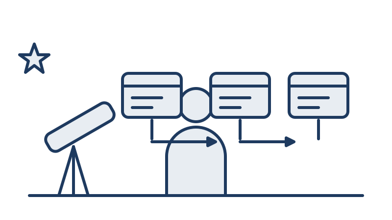
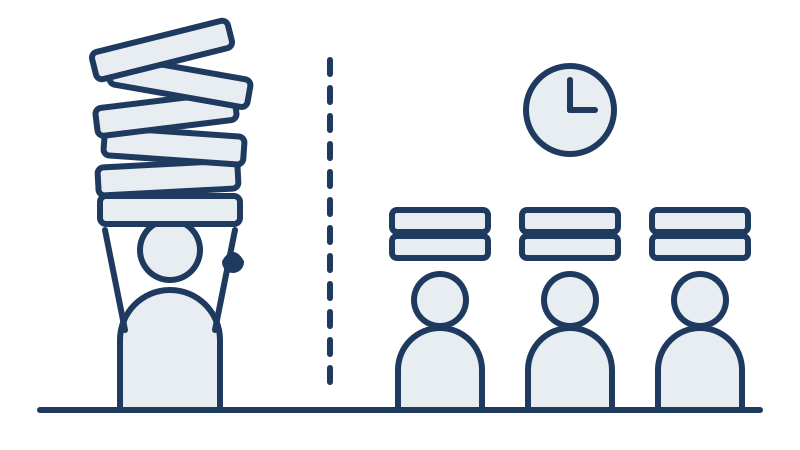
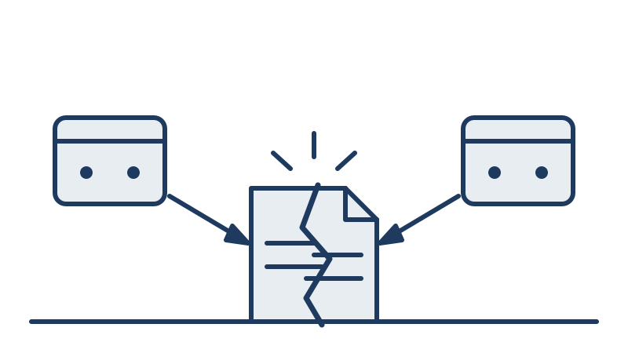
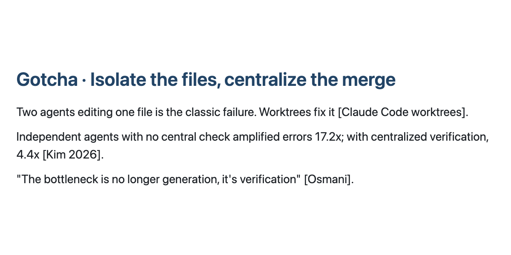
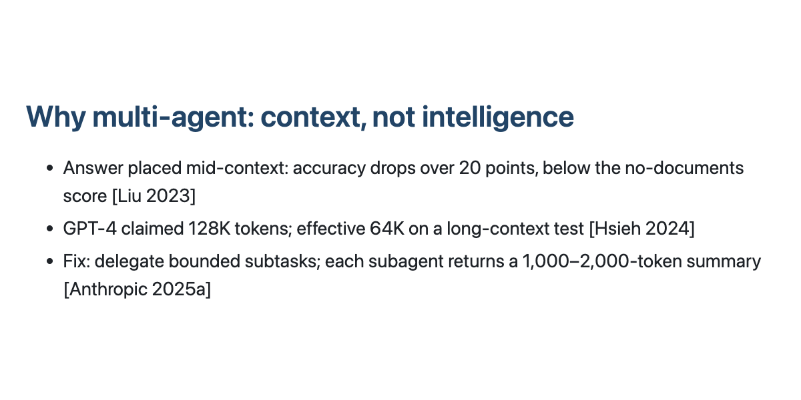
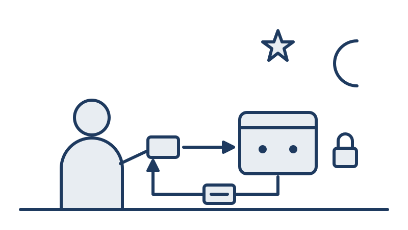

<!-- _class: title -->



# Multi-agent workflows

Shooby Hemmati, IPAC.

GRITS AI workshop, Day 2, advanced track.

<!--
Entry 1. 15 s. Illustration: title.svg, right half, per slides/illustrations/README.md.
Transition: "Yesterday you got one collaborator."
-->

---

# Yesterday you got one collaborator

Yesterday, in Jessica's and Ricky's sessions, you learned what an agent is and you ran Claude Code or Codex on something real. I am not going to re-explain any of that.

Today is about one question: when is a second one worth having?

<!--
Entry 2. 45 s. One-line recap only; do not re-teach agents or Claude Code.
Transition: "Because the temptation is obvious."
-->

---

# Why not more than one?

These agents have been the best collaborator I have had. Do this. Check that. Write the code. Debug it.

When something works that well, the obvious next thought is a team of them. So why not a dozen?

I want to pose that question honestly, and not answer it yet.

<!--
Entry 3. 60 s. Pose the question; do not answer. (Cut candidate 4: fold into entry 4 if running long.)
Transition: "Let me ask a different question first: why do people work in teams?"
-->

---

# Why do people work in teams?

<div class="cols">
<div>

People work in teams for three reasons.

We have limited time, so we split the work. We have limited knowledge, so we bring in someone who knows what we do not. And we have limited attention, so we hand off the pieces we cannot hold in our heads at once.

</div>
<div>



</div>
</div>

<!--
Entry 4, slide 1 of 2. 30 s of 60. Illustration: teams.svg, right of the text.
Transition: "For agents, only two of those three hold."
-->

---

# Why do people work in teams? (2)

For agents, only two of those three hold. Two copies of the same model know exactly the same things, so adding an agent adds no expertise.

It does add attention, a fresh context window, and time, parallel wall-clock. And it adds one thing we also get from a colleague: independence, a reviewer who is not anchored to the draft.

<!--
Entry 4, slide 2 of 2. 30 s of 60.
Transition: "That is the whole thesis."
-->

---

# What multi-agent brings: context, not intelligence

That is the thesis of this talk. Multi-agent buys you context, not intelligence.

One agent's window fills up, and its quality degrades well before it hits the token limit. Parallelism and specialization are real, but second-order.

And most tasks do not need any of this.

<!--
Entry 5, slide 1 of 3. 20 s of 60.
Transition: "Two papers show the degradation."
-->

---

# Context, not intelligence (2): lost in the middle

Two papers show the degradation. In the first, accuracy dropped more than twenty points when the answer sat in the middle of the context, to below what the model scored with no documents at all.

<p class="cite">Liu et al. (2023), Lost in the Middle: How Language Models Use Long Contexts, arXiv 2307.03172: GPT-3.5-Turbo on twenty-document QA fell from about 75.8% with the answer at the start to about 53.8% with the answer mid-context, below its 56.1% closed-book score.</p>

<!--
Entry 5, slide 2 of 3. 20 s of 60.
Transition: "The second paper measured how much of the advertised window is actually usable."
-->

---

# Context, not intelligence (3): the effective window

In the second, claimed context windows were often only half as good as advertised. So the window you pay for is not the window you get, and a fresh window for a subtask is worth more than it looks.

<p class="cite">Hsieh et al. (2024), RULER: What's the Real Context Size of Your Long-Context Language Models?, arXiv 2404.06654: GPT-4 claims 128K tokens; its effective length on RULER's threshold is about 64K. Two papers, two models, two tests; I am not merging their numbers.</p>

<!--
Entry 5, slide 3 of 3. 20 s of 60.
Transition: "Before the patterns, let me fix the words."
-->

---

# Workflows, architectures, and three axes

These words get used loosely, so let me fix them. Anthropic's "Building effective agents" separates workflows, where code decides the order of calls, from agents, where the model decides.

It lists five workflow patterns: prompt chaining, routing, parallelization, orchestrator-workers, and evaluator-optimizer, and it recommends finding the simplest solution possible.

<p class="cite">Anthropic (December 2024), Building effective agents, anthropic.com/research. This is Anthropic's taxonomy, named as such, not a field-wide consensus.</p>

<!--
Entry 6, slide 1 of 2. 35 s of 60. If entry 11 is cut, add one spoken sentence here: "in practice, one orchestrator and two to five workers."
Transition: "Underneath any of those names are three choices."
-->

---

# Workflows, architectures, and three axes (2)

Any multi-agent design comes down to three choices.

**Topology**: how the agents are connected. **Who orchestrates**: a script, a model, or a human. **Isolation**: shared or fresh context, shared files or separate git worktrees.

The four patterns I will show you are common settings of those three dials.

<!--
Entry 6, slide 2 of 2. 25 s of 60.
Transition: "Pattern one."
-->

---

# Pattern 1: fan-out and merge

<div class="cols-even">
<div>

Pattern one is fan-out and merge. The pieces are independent, and there is one merge point.

For a target list, I would run one agent per archive, IRSA, NED, and the Exoplanet Archive, and merge their summaries into one table. The orchestrator never reads the raw query results, only the summaries.

</div>
<div>

{{diagram:fan-out}}

</div>
</div>

<!--
Entry 7. 60 s. Weave in: subagents do not see your conversation; pass what they need, get summaries back, not dumps.
Transition: "Pattern two is what you do when the pieces are not independent."
-->

---

# Pattern 2: pipeline

Pattern two is the pipeline. Sequential steps, each with a fresh context, and files as the hand-off.

A planner writes the plan to a file. An implementer reads it and writes the code. A tester reads the code and runs it. Nobody inherits anyone else's clutter.

<div class="wide">

{{diagram:pipeline}}

</div>

<!--
Entry 8. 60 s. The point is the fresh context at each stage, not the sequence itself. Diagram runs full width under the text because a five-node left-to-right chain is unreadable in a narrow column.
Transition: "Pattern three adds an adversary."
-->

---

# Pattern 3: writer and critic

Pattern three is writer and critic. One agent produces; another reviews adversarially with tools in hand: the tests, the data, the schema. The loop runs a fixed number of rounds, and the script decides that number. A critic without tools rubber-stamps, because all it can do is agree or disagree with prose.

<div class="wide">

{{diagram:writer-critic}}

</div>

<!--
Entry 9. 60 s. Independence is the point: a reviewer not anchored to the draft. Diagram runs full width under the text, as on the pipeline slide, so its labels are legible from the back.
Transition: "Pattern four is not really a fourth topology."
-->

---

# Pattern 4: parallel isolated workers

<div class="cols-even">
<div>

Pattern four is parallel isolated workers. It is not a fourth topology. It is fan-out with the isolation choice made explicit: one git worktree per agent, merged at the end.

The failure it prevents is the classic one: two agents, one file, last write wins.

</div>
<div>

{{diagram:parallel-workers}}

</div>
</div>

<!--
Entry 10, slide 1 of 2. 35 s of 60.
Transition: "The tooling for this already exists."
-->

---

# Pattern 4: parallel isolated workers (2)

Claude Code will do this for you when you ask. With `isolation: worktree` in a subagent's frontmatter, the subagent runs in a temporary git worktree, and Claude Code blocks any Edit or Write that targets a path in the main checkout.

<p class="cite">Anthropic (2026), Run parallel sessions with worktrees, Claude Code documentation: <code>isolation: worktree</code> runs a subagent in a temporary git worktree and blocks edits to the main checkout. A tool-behavior claim from the framework docs, not independently tested outside Claude Code.</p>

<!--
Entry 10, slide 2 of 2. 25 s of 60. The merge at the end still has to be verified; a clean merge is not a correct merge.
Transition: "So how many agents should you actually run?"
-->

---

# How many agents?

One is today's default. Claude Code runs one main conversation and spawns a built-in subagent like Explore only when it decides to.

<p class="cite">Anthropic (2026), Subagents, Claude Code documentation: Claude Code runs one main conversation agent by default, with built-in subagents such as Explore used automatically when appropriate.</p>

<!--
Entry 11, slide 1 of 3. 15 s of 45. (Cut candidate 3: drop entry 11 and say one sentence on entry 6.)
Codex and Cursor were dropped from this slide on 2026-09-17: only Claude Code is documented.
Transition: "Working systems are small."
-->

---

# How many agents? (2)

Working systems use one orchestrator and two to five workers. Anthropic's research system is one Opus 4 lead plus Sonnet 4 subagents. MetaGPT assigns five fixed roles. ChatDev assigns seven.

<p class="cite">Anthropic (June 2025), How we built our multi-agent research system, anthropic.com/engineering. Hong et al. (2024), MetaGPT: Meta Programming for a Multi-Agent Collaborative Framework, arXiv 2308.00352: five roles. Qian et al. (2024), ChatDev: Communicative Agents for Software Development, arXiv 2307.07924: seven roles.</p>

<!--
Entry 11, slide 2 of 3. 15 s of 45. Three separate scale points, not a survey.
Transition: "Bigger exists, in research."
-->

---

# How many agents? (3)

Past a thousand agents exists in research, and nobody uses it for work. That last part is my assessment, not a measurement. There is no published histogram of how many agents practitioners actually run, so I will not pretend there is one.

<p class="cite">Qian et al. (2024), Scaling Large Language Model-based Multi-Agent Collaboration (MacNet), arXiv 2406.07155: supports collaboration among over a thousand agents. Altera.AL (2024), Project Sid: Many-agent simulations toward AI civilization, arXiv 2411.00114: simulations from 10 to 1000+ agents.</p>

<!--
Entry 11, slide 3 of 3. 15 s of 45.
Transition: "And you are already doing some of this."
-->

---

# You already do this

<div class="cols">
<div>

If you have run the same task in Claude Code and in Codex and compared the answers, that was writer and critic, with you as the orchestrator. Two terminals on two tasks is fan-out. Claude Code spawns an Explore subagent without asking you.

The question is when to make it deliberate, and when to replace yourself with a script.

</div>
<div>


</div>
</div>

<!--
Entry 12. 45 s. Illustration: two-terminals.svg, right of the text.
Transition: "Here is what happened when I replaced myself with a script."
-->

---

# This deck was built by the pipeline in this repo

Everything you are looking at, the slides, the diagrams, the evidence, the notes, and the Q&A, was drafted by ten agents in this repo, called in a fixed order by a shell script, with every call logged. I will show you the recipe. First, what went wrong.

<div class="wide">

{{diagram:meta-pipeline}}

</div>

<!--
Entry 13, slide 1 of 2. 20 s of 45. Diagram runs full width under the text; in the narrow column it rendered as an unreadable strip. Review 021 found the edge labels still small at full width; that is a diagrammer fix (larger Mermaid font or shorter edge labels), not a layout one.
Transition: "This is the repository."
-->

---

# This deck was built by the pipeline in this repo (2)

This is the repository layout from the README, trimmed to the files that carry the story. The full listing is in the handout.

```
talk-context.md          audience, schedule, non-goals, thesis, style rules for every agent
slides/outline.md        HUMAN-WRITTEN. Slide order, per-slide message, time budgets, cuts. No agent edits it.
.claude/agents/          ten subagent definitions (see table below)
pipeline/run.sh          deterministic orchestration: stages, the review loop, worktree isolation
research/evidence.md     one source per claim in the outline (written by evidence-finder)
research/build-log.md    how this deck was built, step by step, with pointers into runs/ (written by chronicler)
diagrams/                Mermaid, one file per diagram token in the deck
runs/                    one directory per agent call: exact prompt, full JSON result, return text, cost row
```

<!--
Entry 13, slide 2 of 2. 25 s of 45. Lines copied from README.md via research/build-log.md section 4; omitted lines: pipeline/prompts, pipeline/render.sh, pipeline/cost_report.py, research/briefs, examples/, slides/deck.md, handout/.
Transition: "The first attempt did not have that outline line. Agents wrote the outline too."
-->

---

# Attempt one, from scratch

The first pipeline let agents write the outline, not just the slides. Eleven agent files did the work: four researchers in parallel, an outliner, a slide-writer and a diagrammer in worktrees, three critics for content, design, and teaching, a fact-checker, a notes-writer, a Q&A skeptic, and a demo editor.

Runs 002 through 014 cost $29.22 over 1,222 turns.

<!--
Entry 14, slide 1 of 4. 15 s of 75. Source: research/build-log.md section 1. Run 001 (the interactive research fan-out) is extra and not in that total.
Transition: "Three things broke. The first was my spec."
-->

---

# Attempt one (2): failure 1, the spec contradiction

Run 002. The outliner found that my segment table summed to 27 minutes of content plus 3 of Q&A, my prose said 25 plus 5, and its own instructions demanded 1500 seconds. It could not satisfy all three, so it picked one, scaled three segments down, and logged the choice in its notes rather than choosing silently.

The fix was to the spec, and the stage was re-run as run 003.

<!--
Entry 14, slide 2 of 4. 20 s of 75. Run 002: Sonnet, 22 turns, $0.84, 7.2 min. Run 003: Sonnet, 16 turns, $0.43, 133 s. The agent did the right thing; the spec was wrong.
Transition: "The second failure was the one I had warned about on the pattern slides."
-->

---

# Attempt one (3): failure 2, the shared cost log

<div class="cols">
<div>

Run 004. The slide-writer and the diagrammer ran in two worktrees and never touched each other's outputs. But `log_result.py` appended one row to a single shared `runs/cost.tsv` from inside each worktree, so the merge conflicted on the pipeline's own bookkeeping.

The fix: each run directory writes its own `cost-row.tsv`, and a report is regenerated from every `result.json`.

</div>
<div>



</div>
</div>

<!--
Entry 14, slide 3 of 4. 20 s of 75. Two agents, one file, last write wins: my own orchestration did it, not the agents. Say aloud: nothing appends to a shared file any more. Illustration: merge-conflict.svg, used once, here.
Transition: "The third failure was money."
-->

---

# Attempt one (4): failure 3, the budget cap

Run 006. The first revise pass exhausted the then-default $3 `--max-budget-usd` ceiling after 34 turns. `result.json` said `terminal_reason: budget_exhausted`, but the exit code was 1, not the 2 the docs describe. It had already applied 20 of its 24 changes.

The fix: the default budget went to $5, and the script now reads `result.json` instead of trusting the exit code.

<!--
Entry 14, slide 4 of 4. 20 s of 75. Runs 007 ($2.64) and 008 ($1.62) finished the revision.
Transition: "And then the pipeline finished, and passed every check."
-->

---

# What came out

<div class="cols-even">
<div>

Every constraint was met: citations complete, word counts under the cap, segment timing to the second. The fact-checker confirmed 44 citations, 2 partial, 0 not found.

And it was a wall of cited percentages, plus a twelve-minute demo of screenshots of README files. This is one of its slides.

</div>
<div>



</div>
</div>

<!--
Entry 15, slide 1 of 2. 30 s of 60. The old deck is at commit 707ad48.
Transition: "Why did that happen?"
-->

---

# What came out (2): why

<div class="cols-even">
<div>

The three critics scored what could be counted: citation counts, words per second, and seconds per slide. Nobody scored whether it was a talk.

Agents optimize the rubric you write. Taste is not in the rubric, and it cannot be, so taste has to be a human's.

</div>
<div>



</div>
</div>

<!--
Entry 15, slide 2 of 2. 30 s of 60. This is the moment I admit it did not work.
Transition: "So I reset."
-->

---

# The reset

So I reset. I wrote this outline by hand, and no agent generates or reorders it. This is its first entry, exactly as it sits in `slides/outline.md`; every entry has that shape:

```
1. **Title.** Multi-agent workflows. Shooby Hemmati, IPAC. GRITS Day 2, advanced track. 15 s.
```

Agents draft slides, diagrams, evidence, notes, and reviews for that outline. If one finds a structural problem, it reports it to me under a "For the speaker" heading and does not fix it.

<!--
Entry 16, slide 1 of 2. 30 s of 60. Outline entry copied from research/build-log.md section 4; every entry has that shape: number, bold title, message, seconds.
Transition: "That changed the roster."
-->

---

# The reset (2): retired and added

Retired: the outliner, because I own the outline; the four researchers, whose push-mode briefs nobody used; the three critics, three rubrics that rewarded compliance; and the demo editor.

Added: an evidence-finder that sources only the claims I make, an example-builder that runs the take-home example for real, one reviewer that sits in the audience, a chronicler that records the build, and an illustrator.

<!--
Entry 16, slide 2 of 2. 30 s of 60. Ten agents now, eleven then.
Transition: "Here is what one of those agents actually is."
-->

---

# Recipe, part one: an agent is a markdown file

This is `.claude/agents/reviewer.md`, trimmed to fit. The frontmatter names the agent, says when to use it, lists its tools, and picks the model. The description is cut short here with an ellipsis; the full line, and the other nine files, are in the repo and in the handout.

```
---
name: reviewer
description: Sits in the audience. Reads the deck as a skeptical IPAC engineer
  and looks at the rendered slide images. […]
tools: Read, Glob, Grep, Write
model: inherit
---
```

<!--
Entry 17, slide 1 of 2. 30 s of 60. Lines 1-6 of .claude/agents/reviewer.md; the description line is truncated at […] so the block renders at 19px instead of auto-shrinking. Full text: "...Scores whether each slide earns its time, not whether it complies with a rubric. Never edits; writes a PASS or REVISE review the script uses to decide whether to loop."
Transition: "Below the frontmatter, instructions in plain English."
-->

---

# Recipe, part one (2): the instructions

Then come instructions in plain English, like a brief to a colleague. The last line matters: the script parses it to decide whether to loop.

```
You are the one reviewer. You replace three earlier critics whose rubrics counted citations, words per second, and
seconds per slide; the deck they passed was unpresentable. Do not count things. Judge whether the talk works.

5. Is there a moment where the speaker admits something did not work? If not, say where one belongs.

Write to the run directory you are given as `review.md`. First line exactly `Verdict: PASS` or `Verdict: REVISE`.
```

<!--
Entry 17, slide 2 of 2. 30 s of 60. Lines 7-8, 25, and 36 of reviewer.md, verbatim; the seven review questions in between are in the handout.
Transition: "Part two: how the script calls it."
-->

---

# Recipe, part two: a script calls it headless with a budget

This is the call from `pipeline/run.sh`, exactly. `--agent` picks the markdown file, `--output-format json` returns a parseable result with the cost in it, `--max-budget-usd` caps the spend, and `--no-session-persistence` means no state carries over between calls.

```
  env -u CLAUDECODE claude -p --agent "$agent" \
    --output-format json \
    --permission-mode acceptEdits \
    --allowedTools "$tools" \
    --max-budget-usd "$BUDGET" \
    --no-session-persistence \
    "$(cat "$run_dir/prompt.md")" > "$run_dir/result.json"
```

<!--
Entry 18, slide 1 of 2. 30 s of 60. $BUDGET defaults to 5 after run 006. The prompt is a template with {{RUN_DIR}} substituted, saved as prompt.md before the call.
Transition: "And the script owns the order."
-->

---

# Recipe, part two (2): the stage order

```
evidence  →  example  →  chronicle  →  write (slide-writer + diagrammer + illustrator, 3 worktrees, merged)
  →  loop (critique → revise, until PASS or 2 rounds)  →  chronicle  →  revise  →  factcheck
  →  notes & qa (parallel)  →  cost
```

Evidence, example, and chronicle run one after another: a pipeline. Write is pattern four, three worktrees merged. The loop is writer and critic, and the script owns the loop. Chronicle runs again, then one revise pass places the new build-log entries. Notes and Q&A are fan-out. Cost is a Python script; no model at all.

<!--
Entry 18, slide 2 of 2. 30 s of 60. Stage order from README.md and the `all` case of pipeline/run.sh, via the build log. Chronicle runs twice so the deck can describe its own build honestly.
Transition: "Here is what attempt two has done so far, run by run."
-->

---

# Attempt two, step by step

**Run 015, evidence.** `evidence-finder`, Haiku 4.5 and Sonnet 5, read the outline and the old briefs and wrote `research/evidence.md`. It sourced 13 of 16 claims from existing material and flagged 4 as unsupported rather than guessing. 37 turns, $0.7286, 171 seconds.

**Run 016, example.** `example-builder`, the only agent with Bash, built and ran the exoplanet lookup you will see shortly. 28 turns, $0.3209, 207 seconds.

<!--
Entry 19, slide 1 of 5. 27 s of 75. (Cut candidate 1: drop entry 19 and say "every stage is in runs/, one line each in the handout" on entry 20.)
Transition: "Then the chronicler."
-->

---

# Attempt two, step by step (2)

**Run 017, chronicle.** `chronicler`, Haiku 4.5 and Sonnet 5, read every run directory, the cost report, the agent files, the outline, and the README, and wrote the first `research/build-log.md`. 38 turns, $0.4361, 128 seconds.

**Run 018, write.** Pattern four: `slide-writer`, `diagrammer`, and `illustrator` in three git worktrees at once, merged by the script with no conflict. 42 turns, $4.1925 for the stage.

<!--
Entry 19, slide 2 of 5. 12 s of 75. Per worktree, from the build log: slide-writer, session model, 16 turns, $3.0735, 359 s, wrote slides/deck.md with 53 slides; diagrammer, Sonnet 5, 16 turns, $0.1811, 60 s, five Mermaid files; illustrator, session model, 10 turns, $0.9379, 115 s, five SVGs plus slides/illustrations/README.md. Disjoint files, so the merge was clean.
Transition: "Then the loop: a critic, then the writer, twice."
-->

---

# Attempt two, step by step (3)

**Run 019, critique.** `reviewer`, session model, read the deck and all 54 rendered slide images. 64 turns, $2.9727, 150 seconds. Verdict: REVISE. The illustrations were never placed, two code blocks rendered at about 7 pixels, two diagrams were squeezed unreadable.

**Run 020, revise.** `slide-writer` placed the illustrations, fixed the code blocks, took the diagrams full width. 27 turns, $1.6625, 132 seconds.

<!--
Entry 19, slide 3 of 5. 12 s of 75. Round one of the writer-critic loop. Run 020 also declined the Tran & Kiela title because no file in the repo had one.
Transition: "Round two."
-->

---

# Attempt two, step by step (4)

**Run 021, critique.** `reviewer` again: 63 turns, $2.9859, 171 seconds. Verdict: REVISE. Two illustrations were cover-cropped, the Tran and Kiela citation still lacked a title, and one sentence about diminishing returns had no source.

**Run 022, revise.** `slide-writer` fixed the crops, split a fourteen-line code slide in two, and rewrote that sentence as my own inference. 29 turns, $1.4847, 100 seconds.

<!--
Entry 19, slide 4 of 5. 12 s of 75. Run 022 was the second and last round `--rounds 2` allows. The script logs "rounds exhausted; human review needed" if the verdict is still REVISE; no run 023-critique exists, so the loop's final verdict is not recorded.
Transition: "Then the chronicler came back."
-->

---

# Attempt two, step by step (5)

**Run 023, chronicle.** The second chronicler pass wrote the build log this segment is read from, covering runs 015 through 022. Its own cost was not yet recorded when it wrote that file.

Then one revise pass to place those entries, which is the one you are reading. Not yet run when the log was written: fact-check, notes and Q&A in parallel, and cost.

<!--
Entry 19, slide 5 of 5. 12 s of 75. If the remaining stages have run by talk day, their numbers are in runs/ and the handout; do not quote them from memory.
Transition: "Which brings me to the bill."
-->

---

# What it cost, and the receipts

Attempt one, runs 002 through 014: $29.22, 1,222 turns, 578,569 output tokens, 6,169 seconds of agent time. Run 001, the interactive research fan-out, is extra and was recorded by hand.

Attempt two, runs 015 through 022: $14.7838, 328 turns, 1,593 seconds of wall time. Running total across both attempts, as of run 022: about $44.00. The chronicle pass that recorded this, and every stage after it, are not in that number.

<!--
Entry 20, slide 1 of 2. 20 s of 45. Numbers from research/build-log.md section 5: $29.22 + $14.7838 = $44.0038, summed from each run's own cost-row.tsv because runs/cost-report.md has not been regenerated past run 014.
Transition: "And every dollar has a receipt."
-->

---

# What it cost, and the receipts (2)

Every call left a directory, `runs/NNN-<stage>/`, holding `prompt.md`, the exact prompt sent; `result.json`, the full headless output; `return.md`, what the agent said back; `exit-code`; and its own `cost-row.tsv`.

The cost report is regenerated from every `result.json`. That is how you audit a pipeline instead of trusting it.

<!--
Entry 20, slide 2 of 2. 25 s of 45. The parallel write stage nests slides/, diagrams/, illustrations/ under one run directory.
Transition: "Now the evidence for when this helps and when it hurts."
-->

---

# The one paper that says both

Kim and colleagues ran the same experiment both ways. Centralized multi-agent improved a decomposable task by about 80 percent, and every multi-agent variant made a sequential planning task 39 to 70 percent worse.

<p class="cite">Kim et al. (2026), Towards a Science of Scaling Agent Systems, arXiv 2512.08296: +80.8% on decomposable financial reasoning with a centralized design; sequential planning degraded by 39 to 70% across all four multi-agent variants; 260 configurations, 6 benchmarks, 3 model families.</p>

<!--
Entry 21, slide 1 of 2. 35 s of 60. Per-variant figures, if asked: hybrid −39.0%, decentralized −41.4%, centralized −50.4%, independent −70.0%.
Transition: "So what decides? The shape of the task."
-->

---

# The one paper that says both (2): task shape decides

Task shape decides. If the work decomposes into independent pieces, fan out. If each step depends on the last, keep it in one head.

<!--
Entry 21, slide 2 of 2. 25 s of 60. The second paragraph is now stated as the speaker's inference, per review 021.
Transition: "Here is the rest of the evidence, both sides."
-->

---

# The rest of the evidence: for

For. Anthropic's research system, a lead agent plus subagents, did about 90 percent better than a single agent on breadth research, at about 15 times the tokens of a chat.

<p class="cite">Anthropic (June 2025), How we built our multi-agent research system, anthropic.com/engineering: outperformed single-agent Claude Opus 4 by 90.2% on an internal breadth-research evaluation; multi-agent systems use about 15× more tokens than chats. A vendor claim, not independently replicated.</p>

<!--
Entry 22, slide 1 of 3. 25 s of 75. Same post: token count alone explained 80% of the variance in performance. (Cut candidate 2: drop entry 22, keep Kim et al. only.)
Transition: "Against, twice."
-->

---

# The rest of the evidence: against (2)

Against. At an equal thinking budget, a single agent matched or beat five multi-agent designs. Multi-agent won only when most of the context had been masked or corrupted.

<p class="cite">Tran and Kiela (April 2026), Single-Agent LLMs Outperform Multi-Agent Systems on Multi-Hop Reasoning Under Equal Thinking Token Budgets, arXiv 2604.02460: at a 5,000-token budget, single-agent scored 0.427 against 0.386 for sequential multi-agent, aggregated over three model families; multi-agent won only with up to 70% of the context masked.</p>

<!--
Entry 22, slide 2 of 3. 25 s of 75.
Title added by the orchestrator from the arXiv abstract page (see research/evidence.md and runs/022-revise/orchestrator-hand-fixes.md); the fact-checker verifies it.
Transition: "And the cost side."
-->

---

# The rest of the evidence: against (3)

Against. One agent framework cost over 50 times a simple baseline, and the baseline was more accurate.

<p class="cite">Kapoor et al. (2024), AI Agents That Matter, arXiv 2407.01502: LATS cost over 50 times more than the paper's "Warming" baseline on HumanEval, and Warming scored 93.2% to LATS's 88.0%.</p>

So the honest summary is: it depends on the task, and the token multiple is real either way.

<!--
Entry 22, slide 3 of 3. 25 s of 75. Say "matched or beat," not "similar": the cheap baseline won on accuracy.
Transition: "When it fails, how does it fail?"
-->

---

# How it fails

The MAST study looked at where multi-agent systems break: over 1,600 traces across seven frameworks, fourteen failure modes in three categories. System design, 44.2 percent. Inter-agent misalignment, 32.3 percent. Task verification, 23.5 percent.

Most failures are specification and coordination problems, not model errors.

<p class="cite">Cemri et al. (2025), Why Do Multi-Agent LLM Systems Fail? (MAST), arXiv 2503.13657.</p>

<!--
Entry 23, slide 1 of 2. 35 s of 75. Inter-annotator agreement κ = 0.88.
Transition: "Three of those I see every week."
-->

---

# How it fails (2): the three I see in practice

First, subagents do not see your conversation. Pass what they need in the prompt, and ask for a summary back, not a dump.

Second, two agents on one file. You saw my cost log.

Third, agents spawning agents instead of a script calling agents. The moment the model decides the order, you lose reproducibility.

<!--
Entry 23, slide 2 of 2. 40 s of 75.
Transition: "So let me set one up, the simple way."
-->

---

# Simple example you can run Monday

One read-only subagent. Given ten target names, it queries the NASA Exoplanet Archive with astroquery and returns a table under a token cap. Two tools, Read and Bash, and the cheapest model. The description is cut short with an ellipsis; the full file is in `examples/`.

```
---
name: exoplanet-lookup
description: Read-only lookup of confirmed exoplanet parameters from the
  NASA Exoplanet Archive for a given list of planet names. […]
tools: Read, Bash
model: haiku
---
```

<!--
Entry 24, slide 1 of 5. 40 s of 180. examples/exoplanet-lookup/.claude/agents/exoplanet-lookup.md, lines 1-6; description truncated at […] so the block renders legibly. Full text continues: "Returns a compact table, not a dump. Use for quick target-list checks." The outline says "under 2,000 tokens"; the agent file as built says 600.
Transition: "The instructions."
-->

---

# Simple example you can run Monday (2): the instructions

Below the frontmatter, three rules in plain English: read the file, query the archive, and say "not found" rather than invent a number.

```
You are given a path to a text file with one exoplanet name per line (up to ten names).

Do this:
1. Read the file.
2. For each name, query the NASA Exoplanet Archive (table `pscomppars`) with astroquery for
   columns: `pl_name, hostname, pl_orbper, pl_rade, pl_bmasse, disc_year`. One Python process,
   one query per name (or a single `where` clause with all names), is fine.
3. If a name has no match, say "not found" in that row. Do not invent numbers.
```

<!--
Entry 24, slide 2 of 5. 30 s of 180. Lines 7-14 of the agent file, exact. Read aloud the three rules: read, query, say "not found" rather than invent.
Transition: "Then what to send back."
-->

---

# Simple example you can run Monday (3): the return format

Then the return format. This is the part that keeps the subagent from dumping its whole session back into my window: one table, a source line, and a token cap.

```
Return only a single compact markdown table, one row per input name, columns:
`name | host | period_days | radius_earth | mass_earth | disc_year`.
Round numbers to 3 significant figures. No prose before or after the table, except a one-line
header stating the source ("NASA Exoplanet Archive, pscomppars"). Keep the whole reply under
600 tokens.
```

<!--
Entry 24, slide 3 of 5. 25 s of 180. Lines 16-20 of the agent file, exact. Weave in: summaries, not dumps.
Transition: "One command."
-->

---

# Simple example you can run Monday (4): the command

One command, headless, with a one-dollar cap. The output is JSON, so the cost and the token counts come back with the answer.

```
env -u CLAUDECODE claude -p --agent exoplanet-lookup --allowedTools "Read,Bash" \
  --max-budget-usd 1 --output-format json \
  "Look up the exoplanets listed one per line in targets.txt in the NASA Exoplanet Archive and return the table."
```

<!--
Entry 24, slide 4 of 5. 40 s of 180. From examples/exoplanet-lookup/RESULT.md; run.sh in the same directory wraps it and saves the JSON under runs/.
Transition: "And here is what actually came back."
-->

---

# Simple example you can run Monday (5): the real result

```
NASA Exoplanet Archive, pscomppars

| name | host | period_days | radius_earth | mass_earth | disc_year |
|------|------|-------------|--------------|------------|-----------|
| Kepler-10 b | Kepler-10 | 0.837 | 1.47 | 3.24 | 2011 |
| TRAPPIST-1 e | TRAPPIST-1 | 6.10 | 0.920 | 0.692 | 2017 |
| Proxima Cen b | Proxima Cen | 11.2 | 1.02 | 1.05 | 2016 |
```

Ten rows, about 250 tokens. Model `claude-haiku-4-5`, cost $0.0751, wall time 82.5 seconds, 8 turns. One caveat: total output including thinking was 7,321 tokens, so the cap applies to the table I see, not to everything the agent emits.

<!--
Entry 24, slide 5 of 5. 45 s of 180. Three of the ten rows shown; the full table is in examples/exoplanet-lookup/RESULT.md and the handout. It succeeded on the first real attempt.
Transition: "That is the simple end. The difficult end is this talk."
-->

---

# Cost, and when it is worth it

Multi-agent runs three to fifteen times a single chat's tokens, by Anthropic's own figures, from two of their posts.

<p class="cite">Anthropic (June 2025), How we built our multi-agent research system, anthropic.com/engineering: multi-agent systems use about 15× more tokens than chats. Anthropic, Phillips et al. (January 2026), Building multi-agent systems: when and how to use them, claude.com/blog: multi-agent implementations typically use 3 to 10× more tokens. Vendor figures; the range on the slide spans both.</p>

<!--
Entry 26, slide 1 of 3. 20 s of 60.
Transition: "So spend the multiple carefully."
-->

---

# Cost, and when it is worth it (2)

Put cheap or local models on subagents and the frontier model on the orchestrator. Claude Code's subagent frontmatter takes a `model` field, so you can pin a cheap model on a subagent, for example your own Explore pinned to Haiku, while the orchestrator stays on the frontier model. Which model, and what it costs, was Nick's talk this morning.

<p class="cite">Anthropic (2026), Create custom subagents, Claude Code documentation: <code>model</code> takes haiku, sonnet, opus, fable, or inherit; the built-in Explore inherits the main conversation's model by default unless you define a custom Explore pinned to a cheaper one (fetched 2026-09-17).</p>

<!--
Entry 26, slide 2 of 3. 20 s of 60. Do not present pricing; point to Nick.
Transition: "Let me close."
-->

---

# Cost, and when it is worth it (3): the difficult example

The difficult example is this pipeline: ten agents, a script that owns order, loop, and isolation, and a log for every call.

When to bother: the work exceeds one window, the pieces are independent, the output needs an independent check, and you can afford the multiple. Otherwise, one agent. Most of my own work is still one agent.

<!--
Entry 26, slide 3 of 3. 20 s of 60. Folded from the old entry 25 on 2026-09-17.
Transition: "So, to close."
-->

---

# Close



Context, not intelligence. Most tasks need one agent.

Your first step on Monday: pull one bounded, read-only task into its own agent file, run it once headless with a budget cap, and check that the return is short.

And the hand-off in one line: many unsupervised agents means you need sandboxing, and that is BJ, next.

<!--
Entry 27. 60 s. Illustration: close.svg, right half. Then 180 s of Q&A; likely questions are in handout/qa.md.
Transition: hand to BJ.
-->

---

<!-- _class: sources -->

# Sources (1): segments A and B

Liu et al. (2023), Lost in the Middle: https://arxiv.org/abs/2307.03172

Hsieh et al. (2024), RULER: https://arxiv.org/abs/2404.06654

Anthropic (December 2024), Building effective agents: https://www.anthropic.com/research/building-effective-agents

Anthropic (2026), Run parallel sessions with worktrees, Claude Code docs: https://code.claude.com/docs/en/worktrees

Anthropic (2026), Subagents, Claude Code docs: https://code.claude.com/docs/en/sub-agents

Anthropic (June 2025), How we built our multi-agent research system: https://www.anthropic.com/engineering/multi-agent-research-system

Hong et al. (2024), MetaGPT: https://arxiv.org/abs/2308.00352

Qian et al. (2024), ChatDev: https://arxiv.org/abs/2307.07924

Qian et al. (2024), MacNet, Scaling Large Language Model-based Multi-Agent Collaboration: https://arxiv.org/abs/2406.07155

Altera.AL (2024), Project Sid: https://arxiv.org/abs/2411.00114

<!--
Not presented.
-->

---

<!-- _class: sources -->

# Sources (2): segments C, D, and E

Segment C has no external sources: research/build-log.md, README.md, pipeline/run.sh, .claude/agents/reviewer.md, examples/exoplanet-lookup/, and runs/ in this repository. The first deck is at commit 707ad48.

Kim et al. (2026), Towards a Science of Scaling Agent Systems: https://arxiv.org/abs/2512.08296

Anthropic (June 2025), How we built our multi-agent research system: https://www.anthropic.com/engineering/multi-agent-research-system

Tran and Kiela (April 2026), Single-Agent LLMs Outperform Multi-Agent Systems on Multi-Hop Reasoning Under Equal Thinking Token Budgets: https://arxiv.org/abs/2604.02460

Kapoor et al. (2024), AI Agents That Matter: https://arxiv.org/abs/2407.01502

Cemri et al. (2025), Why Do Multi-Agent LLM Systems Fail? (MAST): https://arxiv.org/abs/2503.13657

Anthropic, Phillips et al. (January 2026), Building multi-agent systems: when and how to use them: https://claude.com/blog/building-multi-agent-systems-when-and-how-to-use-them

Anthropic (2026), Create custom subagents, Claude Code docs: https://code.claude.com/docs/en/sub-agents

<!--
Not presented.
-->
