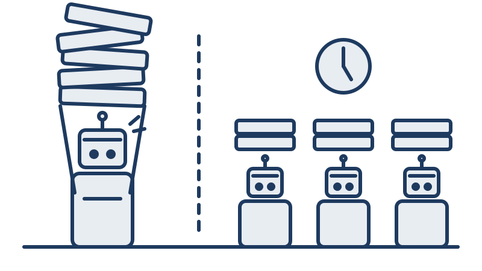
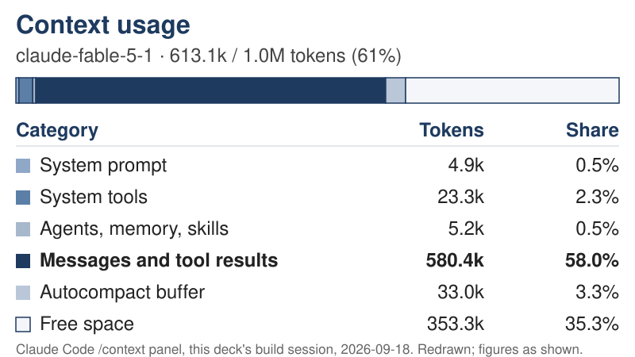
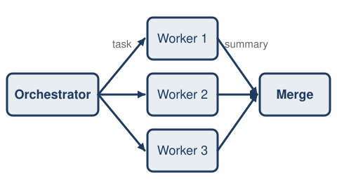
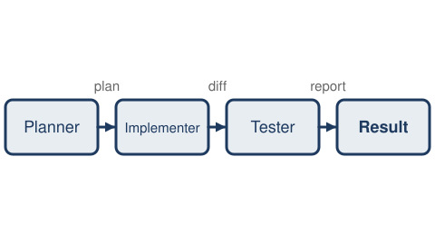
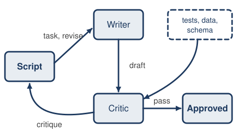
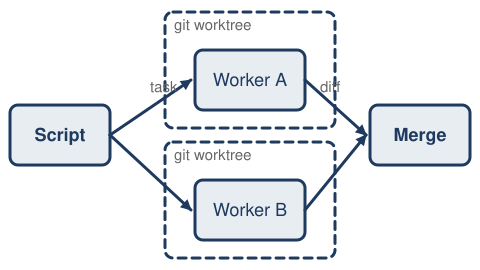

<!-- _class: title -->



# Multi-agent workflows

Shoubaneh Hemmati, Caltech/IPAC.

GRITS AI workshop, September 2026.

<span class="cite">Repository: github.com/xoubish/multiGrits</span>

<!--
Entry 1. 15 s. Illustration: agents.svg, right half (replaced title.svg on 2026-09-18 on the speaker's instruction; the same figure returns on the second slide of entry 4).
Transition: "One collaborator first."
-->

---

# One collaborator, then more

This talk assumes prior use of a coding agent such as Claude Code or Codex on real work. A single agent already plans, writes, checks, and debugs on request, and it has been the best collaborator I have had.

When one collaborator works that well, the obvious next step is a team of them. This talk poses that question before answering it.

<!--
Entries 2 and 3, merged 2026-09-18 on the speaker's instruction. 105 s. Do not re-teach agents or the tools; pose the question, do not answer it yet.
Transition: "A different question comes first: why do people work in teams?"
-->

---

# Why do people work in teams?

<div class="cols">
<div>

People work in teams for many reasons, some of them social. Four bear on agents, and cost shapes all four.

- Time is limited, so the work is divided.
- Knowledge is limited, so expertise is brought in.
- Attention is limited, so pieces are handed off (Simon 1971).
- Judgment is anchored to our own drafts, so others check them.
- Cost sets the mix: one Einstein might do the work of five.

</div>
<div>


</div>
</div>
<!--
Entry 4, slide 1 of 2. 30 s of 60. Illustration: teams.svg, right of the text. Simon (1971): "a wealth of information creates a poverty of attention"; full reference on the Sources slide. Reworded 2026-09-18: four reasons that bear on agents; the social ones (belonging, motivation, accountability, shared risk) are real for people and do not transfer, and the list is not claimed to be exhaustive. Say that aloud, and add the punchline to the cost bullet aloud: if IPAC could afford one.
Transition: "Which of the four hold for agents?"
-->

---

# Which of those reasons hold for agents?

<div class="cols">
<div>

Three of the four hold for agents; one holds in part.

- Time holds: agents run in parallel.
- Knowledge holds in part: copies of one model know the same things; other models or tools add some.
- Attention holds: each agent brings a fresh context window.
- Judgment holds: a second agent is not anchored to the first draft.
- Cost sets the mix here too: several cheap models for the price of one frontier model, which often wins anyway.

</div>
<div>


</div>
</div>
<!--
Entry 4, slide 2 of 2. 30 s of 60. Illustration: agents.svg, the robot counterpart of teams.svg, right of the text. Reworded 2026-09-18: heterogeneous agents (different models, tools, or data) can add knowledge; the reliable gains are attention and time.
Transition: "That is the thesis."
-->

---

# What multi-agent brings: more context than intelligence

Multi-agent buys more context than intelligence. Windows have grown about five hundredfold in six years; the usable window has not kept pace, and most tasks need none of this.

| Year | Model | Context window | Source |
|---|---|---|---|
| 2020 | GPT-3 | 2,048 tokens | Brown et al. 2020 |
| 2024 | GPT-4 Turbo; Claude 3 | 128K; 200K | Gemini Team 2024 |
| 2024 | Gemini 1.5 | retrieval tested to 10M, in research | Gemini Team 2024 |
| 2026 | Claude Fable 5.1, Opus 5, Sonnet 5 | 1M | Anthropic 2026, models page |

In English prose a token is about 0.55 to 0.75 of a word, so 1M tokens is roughly 550,000 to 750,000 words (Anthropic 2026).

<!--
Entry 5, slide 1 of 4. 20 s of 80. 2,048 to 1,000,000 is 488x. The Gemini figure is a research result, not a product window. Anthropic figures fetched 2026-09-18: the models page says 1M tokens is roughly 555k words on the current tokenizer and about 750k words on models before Opus 4.7; 200K tokens is roughly 150k words. Code and numbers use more tokens per word than prose.
Transition: "First, what a window actually holds."
-->

---

# What fills a context window

<div class="cols-even">
<div>

- Each turn re-sends the whole window: system prompt, tool definitions, messages both ways, and every tool result.
- Tool results dominate: 580K of the 613K tokens in use in this deck's build session.
- When it fills, Claude Code compacts: the older transcript becomes a summary, and unsaved detail is lost.
- A subagent's transcript stays in its own window; only its return enters the parent's.

</div>
<div>



</div>
</div>
<!--
Entry 5, slide 2 of 4. 20 s of 80. Added 2026-09-18 on the speaker's instruction. Chart redrawn from the /context panel of the session that built this deck (claude-fable-5-1, 613.1k of 1.0M tokens, 61%). The 128K max-output figure is a separate per-reply limit, not the window.
Transition: "The advertised window is not the usable one."
-->

---

# The usable window is smaller than the advertised one

- Accuracy fell more than twenty points when the answer sat in the middle of the context, below the score with no documents at all (Liu et al. 2023).
- GPT-4 advertised 128K tokens; its effective length was about 64K (Hsieh et al. 2024).
- Models effectively use only 10 to 20 percent of their context (Kuratov et al. 2024).
- Without literal word overlap between question and answer, 11 of 13 long-context models fell below half their short-context accuracy by 32K tokens (Modarressi et al. 2025).
- Human memory shows the same position curve, but the similarity is shallow: people compact to gist within seconds and keep almost no wording, while a model keeps every token and loses the ability to attend to them (Jarvella 1971; Guo and Vosoughi 2025).

<!--
Entry 5, slide 3 of 4. 20 s of 80. Four benchmarks, four model sets; numbers are not merged. Human line added 2026-09-18: listeners repeat only the clause they are in verbatim (Jarvella 1971; Sachs 1967 for the 80-syllable result); LLMs show primacy and recency like human list recall (Guo and Vosoughi 2025), but n-back studies warn the analogy is shallow. Full references on the Sources slide. If asked: GPT-3.5 fell from about 75.8% to 53.8% against a 56.1% closed-book score (Liu); GPT-4o fell from 99.3% to 69.7% (Modarressi).
Transition: "And the honest counterpoint."
-->

---

# One strong model with a long window

- Given enough budget, one long-context model consistently outperforms retrieval over pieces of the material, at higher cost (Li et al. 2024).
- At an equal thinking budget, a single agent matched or beat five multi-agent designs (Tran and Kiela 2026).
- Splitting pays only when the work exceeds what one strong window handles well, or when independence or wall-clock matter.

<!--
Entry 5, slide 4 of 4. 20 s of 80. Added 2026-09-18 on the speaker's instruction: one frontier model with a long window is often the better choice. Tran and Kiela: 0.427 against 0.386 at a 5,000-token budget; the result returns in segment D.
Transition: "Before the patterns, definitions first."
-->

---

# Elements of a multi-agent system

<div class="cols-even">
<div>

Designing a multi-agent system means thinking along three axes, taken one at a time on the next three slides.

- **Who orchestrates**: a script, a model, or a human.
- **Isolation**: shared or fresh context; shared files or separate git worktrees.
- **Topology**: how the agents are connected.


</div>
<div>


</div>
</div>
<!--
Entry 6, slide 1 of 4. 20 s of 80. If asked whether the axes are standard terms: the literature says coordination architecture (Kim et al. 2026) or structure (Tran et al. 2025) for topology, orchestrator-workers (Anthropic 2024), and context or worktree isolation (Anthropic 2026); the three-axis framing is the speaker's. Illustration: orchestra.svg, a conductor robot with a score on a stand and five robot musicians, right of the text. Restructured 2026-09-18 on the speaker's instruction; order is orchestration, isolation, topology. If entry 11 is cut, add one spoken sentence here: "in practice, one orchestrator and two to five workers."
Transition: "The first axis: who decides the order."
-->

---

# Axis 1, who orchestrates: a script, a model, or a human

<div class="cols">
<div>

- A script fixes the sequence in advance: which agent runs, in what order, how many rounds. Anthropic calls this a workflow.
- The model chooses each next step at run time, including whether to call another agent. Anthropic calls this an agent (Anthropic 2024).
- A person can orchestrate too: two terminals, the human as merge point.
- Scripts are reproducible; a model deciding is flexible but hard to reproduce. This pipeline is a workflow.

</div>
<div>


</div>
</div>
<!--
Entry 6, slide 2 of 4. 20 s of 80. Illustration: orchestrator.svg, one robot at a desk with two laptops, right of the text. Anthropic's advice in the same post: use the simplest arrangement that works. Anthropic, "Building effective agents", December 2024, also names five workflow patterns (prompt chaining, routing, parallelization, orchestrator-workers, evaluator-optimizer); they map onto the four here and are not used further. This is Anthropic's taxonomy, not a field consensus.
Transition: "The second axis: what the agents share."
-->

---

# Axis 2, isolation: what the agents share

- Context: shared, so one agent carries everything; or fresh, so each stage starts empty and receives only what it needs. Fresh context is the gain the previous section argued for.
- Files: shared, so two agents can write the same file; or one git worktree per agent, merged at the end.
- A Claude Code subagent starts with a fresh context and receives only the delegation message (Anthropic 2026).
- The failure isolation prevents is two agents writing one file; an instance appears in attempt one.

<!--
Entry 6, slide 3 of 4. 20 s of 80. Anthropic (2026), Subagents, Claude Code documentation: a subagent's context starts fresh with its system prompt, the delegation message, CLAUDE.md and a git snapshot, not the parent's history.
Transition: "The third axis: how the agents are connected."
-->

---

# Axis 3, topology: how the agents are connected

Four common topologies, each a pattern that follows. Where errors are caught matters: independent agents amplified errors 17.2 times, a centralized check 4.4 times (Kim et al. 2026).

<div class="grid2">
<div>



Fan-out and merge: independent pieces, one merge point.

</div>
<div>



Pipeline: a chain, each stage hands its output to the next.

</div>
<div>



Writer and critic: a loop, run a fixed number of rounds.

</div>
<div>



Isolated workers: fan-out with one worktree per agent.

</div>
</div>
<!--
Entry 6, slide 4 of 4. 20 s of 80. Figures: slides/illustrations/pattern-*.svg, redrawn 2026-09-18 from the Mermaid diagrams; the same figures appear at full size on the four pattern slides. The 17.2x and 4.4x figures were confirmed by the fact-checker in the first deck (runs/009-factcheck).
Transition: "Pattern one: fan-out and merge."
-->

---

# Pattern 1: fan-out and merge

<div class="cols-even">
<div>

Pattern 1, fan-out and merge, suits work with independent pieces and one merge point.

For a target list, one agent per archive, IRSA, NED, and the Exoplanet Archive, queries its archive, and the orchestrator merges their summaries into one table. The orchestrator never reads the raw query results, only the summaries.

</div>
<div>


</div>
</div>

<!--
Entry 7. 60 s. Weave in: subagents do not see your conversation; pass what they need, get summaries back, not dumps.
Transition: "Pattern two is for pieces that are not independent."
-->

---

# Pattern 2: pipeline

Pattern 2, the pipeline, is a sequence of steps, each with a fresh context and files as the hand-off.

A planner writes the plan to a file. An implementer reads it and writes the code. A tester reads the code and runs it. No stage inherits another stage's clutter.

<div class="wide">


</div>

<!--
Entry 8. 60 s. The point is the fresh context at each stage, not the sequence itself. Diagram runs full width under the text because a five-node left-to-right chain is unreadable in a narrow column.
Transition: "Pattern three adds an adversary."
-->

---

# Pattern 3: writer and critic

Pattern 3, writer and critic, has one agent produce and another review adversarially with tools in hand: the tests, the data, the schema. The loop runs a fixed number of rounds, and the script decides that number. A critic without tools rubber-stamps, because all it can do is agree or disagree with prose.

<div class="wide">


</div>

<!--
Entry 9. 60 s. Independence is the point: a reviewer not anchored to the draft. Diagram runs full width under the text, as on the pipeline slide, so its labels are legible from the back.
Transition: "Pattern four is not really a fourth topology."
-->

---

# Pattern 4: parallel isolated workers

<div class="cols-even">
<div>

Pattern 4, parallel isolated workers, is not a fourth topology. It is fan-out with the isolation choice made explicit: one git worktree per agent, merged at the end.

The failure it prevents is the classic one: two agents, one file, last write wins.

</div>
<div>


</div>
</div>

<!--
Entry 10, slide 1 of 2. 35 s of 60.
Transition: "The tooling for this already exists."
-->

---

# Pattern 4: worktree isolation in practice

Claude Code supports this directly. With `isolation: worktree` in a subagent's frontmatter, the subagent runs in a temporary git worktree, and Claude Code blocks any Edit or Write that targets a path in the main checkout.

<p class="cite">Anthropic (2026), Run parallel sessions with worktrees, Claude Code documentation: <code>isolation: worktree</code> runs a subagent in a temporary git worktree and blocks edits to the main checkout. A tool-behavior claim from the framework docs, not independently tested outside Claude Code.</p>

<!--
Entry 10, slide 2 of 2. 25 s of 60. The merge at the end still has to be verified; a clean merge is not a correct merge.
Transition: "So how many agents should one actually run?"
-->

---

# How many agents?

One agent is the default in current tools. Claude Code runs one main conversation and spawns a built-in subagent such as Explore only when it decides to.

<p class="cite">Anthropic (2026), Subagents, Claude Code documentation: Claude Code runs one main conversation agent by default, with built-in subagents such as Explore used automatically when appropriate.</p>

<!--
Entry 11, slide 1 of 3. 15 s of 45. (Cut candidate 3: drop entry 11 and say one sentence on entry 6.)
Codex and Cursor were dropped from this slide on 2026-09-17: only Claude Code is documented, so the citation covers Claude Code only.
Transition: "Working systems are small."
-->

---

# How many agents? Working systems are small

Working systems use one orchestrator and two to five workers. Anthropic's research system is one Opus 4 lead plus Sonnet 4 subagents. MetaGPT assigns five fixed roles. ChatDev assigns seven.

<p class="cite">Anthropic (June 2025), How we built our multi-agent research system, anthropic.com/engineering. Hong et al. (2024), MetaGPT: Meta Programming for a Multi-Agent Collaborative Framework, arXiv 2308.00352: five roles. Qian et al. (2024), ChatDev: Communicative Agents for Software Development, arXiv 2307.07924: seven roles.</p>

<!--
Entry 11, slide 2 of 3. 15 s of 45. Three separate scale points, not a survey.
Transition: "Larger systems exist in research."
-->

---

# How many agents? The large end

Systems past a thousand agents exist in research, and nobody uses them for work. That last statement is an assessment, not a measurement. There is no published histogram of how many agents practitioners run, and none is claimed here.

<p class="cite">Qian et al. (2024), Scaling Large Language Model-based Multi-Agent Collaboration (MacNet), arXiv 2406.07155: supports collaboration among over a thousand agents. Altera.AL (2024), Project Sid: Many-agent simulations toward AI civilization, arXiv 2411.00114: simulations from 10 to 1000+ agents.</p>

<!--
Entry 11, slide 3 of 3. 15 s of 45.
Transition: "And some of this is already common practice."
-->

---

# You already do this

<div class="cols">
<div>

Running the same task in Claude Code and in Codex and comparing the answers is writer and critic, with the human as orchestrator. Two terminals on two tasks is fan-out. Claude Code spawns an Explore subagent without being asked.

The question is when to make this deliberate, and when to replace the human orchestrator with a script.

</div>
<div>


</div>
</div>

<!--
Entry 12. 45 s. Illustration: two-terminals.svg, right of the text.
Transition: "Here is what happened when I replaced myself with a script."
-->

---

# This deck was built by the pipeline in this repo

Every part of this deck, the slides, the diagrams, the evidence, the notes, and the Q&A, was drafted by ten agents in this repository, called in a fixed order by a shell script, with every call logged. What follows is the recipe, beginning with what went wrong.

<div class="wide">

{{diagram:meta-pipeline}}

</div>

<!--
Entry 13, slide 1 of 2. 20 s of 45. Diagram runs full width under the text; in the narrow column it rendered as an unreadable strip. Review 021 found the edge labels still small at full width; that is a diagrammer fix (larger Mermaid font or shorter edge labels), not a layout one.
Transition: "This is the repository."
-->

---

# The repository

This is the repository layout from the README, trimmed to the files that carry the story. The full listing is in the handout and in the repository, github.com/xoubish/multiGrits.

```
talk-context.md          audience, schedule, non-goals, thesis, style rules for every agent
slides/outline.md        HUMAN-WRITTEN. Slide order, per-slide message, time budgets, cuts. No agent edits it.
.claude/agents/          ten subagent definitions (see table below)
pipeline/run.sh          deterministic orchestration: stages, the review loop, worktree isolation
research/evidence.md     one source per claim in the outline (written by evidence-finder)
research/build-log.md    how this deck was built, step by step, with pointers into runs/ (written by chronicler)
diagrams/                Mermaid, one file per diagram token in the deck
runs/                    one directory per agent call: exact prompt, full JSON result, return text, cost row
```

<!--
Entry 13, slide 2 of 2. 25 s of 45. Lines copied from README.md via research/build-log.md section 4; omitted lines: pipeline/prompts, pipeline/render.sh, pipeline/cost_report.py, research/briefs, examples/, slides/deck.md, handout/.
Transition: "The first attempt did not have that outline line. Agents wrote the outline too."
-->

---

# Attempt one, from scratch

The first pipeline let agents write the outline, not just the slides. Eleven agent files did the work: four researchers in parallel, an outliner, a slide-writer and a diagrammer in worktrees, three critics for content, design, and teaching, a fact-checker, a notes-writer, a Q&A skeptic, and a demo editor.

Runs 002 through 014 cost $29.22 over 455 turns.

<!--
Entry 14, slide 1 of 4. 15 s of 75. Source: research/build-log.md section 1. Run 001 (the interactive research fan-out) is extra and not in that total.
Transition: "Three things broke. The first was my spec."
-->

---

# Attempt one, failure 1: the spec contradiction

In run 002, the outliner found that my segment table summed to 27 minutes of content plus 3 of Q&A, my prose said 25 plus 5, and its own instructions demanded 1500 seconds. It could not satisfy all three, so it picked one, scaled three segments down, and logged the choice in its notes rather than choosing silently.

The fix was to the spec, and the stage was re-run as run 003.

<!--
Entry 14, slide 2 of 4. 20 s of 75. Run 002: Sonnet, 22 turns, $0.84, 7.2 min. Run 003: Sonnet, 16 turns, $0.43, 133 s. The agent did the right thing; the spec was wrong.
Transition: "The second failure was the one I had warned about on the pattern slides."
-->

---

# Attempt one, failure 2: the shared cost log

<div class="cols">
<div>

In run 004, the slide-writer and the diagrammer ran in two worktrees and never touched each other's outputs. But `log_result.py` appended one row to a single shared `runs/cost.tsv` from inside each worktree, so the merge conflicted on the pipeline's own bookkeeping.

The fix was for each run directory to write its own `cost-row.tsv`, with a report regenerated from every `result.json`.

</div>
<div>


</div>
</div>

<!--
Entry 14, slide 3 of 4. 20 s of 75. Two agents, one file, last write wins: my own orchestration did it, not the agents. Say aloud: nothing appends to a shared file any more. Illustration: merge-conflict.svg, used once, here.
Transition: "The third failure was money."
-->

---

# Attempt one, failure 3: the budget cap

In run 006, the first revise pass exhausted the then-default $3 `--max-budget-usd` ceiling after 34 turns. `result.json` said `terminal_reason: budget_exhausted`, but the exit code was 1, not the 2 the docs describe. It had already applied 20 of its 24 changes.

The fix was to raise the default budget to $5 and have the script read `result.json` instead of trusting the exit code.

<!--
Entry 14, slide 4 of 4. 20 s of 75. Runs 007 ($2.64) and 008 ($1.62) finished the revision.
Transition: "And then the pipeline finished, and passed every check."
-->

---

# What came out

<div class="cols-even">
<div>

Every constraint was met: citations complete, word counts under the cap, segment timing to the second. The fact-checker confirmed 44 citations, 2 partial, 0 not found.

And it was a wall of cited percentages, plus a twelve-minute demo of screenshots of README files. This is one of its slides.

</div>
<div>


</div>
</div>

<!--
Entry 15, slide 1 of 2. 30 s of 60. The old deck is at commit 707ad48.
Transition: "Why did that happen?"
-->

---

# What came out, and why

<div class="cols-even">
<div>

The three critics scored what could be counted: citation counts, words per second, and seconds per slide. Nobody scored whether it was a talk.

Agents optimize the rubric they are given. Taste is not in the rubric, and it cannot be, so taste has to be a human's.

</div>
<div>


</div>
</div>

<!--
Entry 15, slide 2 of 2. 30 s of 60. This is the moment I admit it did not work.
Transition: "The pipeline was reset."
-->

---

# The reset

The pipeline was reset. I wrote this outline by hand, and no agent generates or reorders it. This is its first entry exactly as it sits in `slides/outline.md`; every entry has that shape:

```
1. **Title.** Multi-agent workflows. Shoubaneh Hemmati, Caltech/IPAC. GRITS AI workshop, September 2026. 15 s.
```

Agents draft slides, diagrams, evidence, notes, and reviews for that outline. If one finds a structural problem, it reports it to me under a "For the speaker" heading and does not fix it.

<!--
Entry 16, slide 1 of 2. 30 s of 60. Outline entry copied from research/build-log.md section 4; every entry has that shape: number, bold title, message, seconds.
The outline's header records that entries 1, 2, 24, 26 and 27 were reworded on 2026-09-18; the block shows the wording the build log recorded. TODO: refresh this block when the chronicler next updates research/build-log.md.
Transition: "That changed the roster."
-->

---

# The reset: retired and added

Retired were the outliner, because I own the outline; the four researchers, whose push-mode briefs nobody used; the three critics, three rubrics that rewarded compliance; and the demo editor.

Added were an evidence-finder that sources only the claims I make, an example-builder that runs the take-home example for real, one reviewer that sits in the audience, a chronicler that records the build, and an illustrator.

<!--
Entry 16, slide 2 of 2. 30 s of 60. Ten agents now, eleven then.
Transition: "Here is what one of those agents actually is."
-->

---

# Recipe, part one: an agent is a markdown file

This is `.claude/agents/reviewer.md`, trimmed to fit. The frontmatter names the agent, says when to use it, lists its tools, and picks the model. The description is cut short here with an ellipsis; the full line, and the other nine files, are in the repo and in the handout.

```
---
name: reviewer
description: Sits in the audience. Reads the deck as a skeptical IPAC engineer
  and looks at the rendered slide images. […]
tools: Read, Glob, Grep, Write
model: inherit
---
```

<!--
Entry 17, slide 1 of 2. 30 s of 60. Lines 1-6 of .claude/agents/reviewer.md; the description line is truncated at […] so the block renders at 19px instead of auto-shrinking. Full text: "...Scores whether each slide earns its time, not whether it complies with a rubric. Never edits; writes a PASS or REVISE review the script uses to decide whether to loop."
Transition: "Below the frontmatter, instructions in plain English."
-->

---

# Recipe, part one: the instructions

Below the frontmatter come instructions in plain English, like a brief to a colleague. The last line matters, because the script parses it to decide whether to loop.

```
You are the one reviewer. You replace three earlier critics whose rubrics counted citations, words per second, and
seconds per slide; the deck they passed was unpresentable. Do not count things. Judge whether the talk works.

5. Is there a moment where the speaker admits something did not work? If not, say where one belongs.

Write to the run directory you are given as `review.md`. First line exactly `Verdict: PASS` or `Verdict: REVISE`.
```

<!--
Entry 17, slide 2 of 2. 30 s of 60. Lines 7-8, 25, and 36 of reviewer.md, verbatim; the seven review questions in between are in the handout.
Transition: "Part two: how the script calls it."
-->

---

# Recipe, part two: a script calls it headless with a budget

This is the call from `pipeline/run.sh`, exactly. `--agent` picks the markdown file, `--output-format json` returns a parseable result with the cost in it, `--max-budget-usd` caps the spend, and `--no-session-persistence` means no state carries over between calls.

```
  env -u CLAUDECODE claude -p --agent "$agent" \
    --output-format json \
    --permission-mode acceptEdits \
    --allowedTools "$tools" \
    --max-budget-usd "$BUDGET" \
    --no-session-persistence \
    "$(cat "$run_dir/prompt.md")" > "$run_dir/result.json"
```

<!--
Entry 18, slide 1 of 2. 30 s of 60. $BUDGET defaults to 5 after run 006. The prompt is a template with {{RUN_DIR}} substituted, saved as prompt.md before the call.
Transition: "And the script owns the order."
-->

---

# Recipe, part two: the stage order

```
evidence  →  example  →  chronicle  →  write (slide-writer + diagrammer + illustrator, 3 worktrees, merged)
  →  loop (critique → revise, until PASS or 2 rounds)  →  chronicle  →  revise  →  factcheck
  →  notes & qa (parallel)  →  cost
```

Evidence, example, and chronicle run one after another, which is a pipeline. Write is pattern 4, three worktrees merged. The loop is writer and critic, and the script owns the loop. Chronicle runs again, and one revise pass places the new build-log entries. Notes and Q&A are fan-out. Cost is a Python script and uses no model at all.

<!--
Entry 18, slide 2 of 2. 30 s of 60. Stage order from README.md and the `all` case of pipeline/run.sh, via the build log. Chronicle runs twice so the deck can describe its own build honestly.
Transition: "Here is what attempt two has done so far, run by run."
-->

---

# Attempt two: runs 015 and 016

**Run 015, evidence.** `evidence-finder`, Haiku 4.5 and Sonnet 5, read the outline and the old briefs and wrote `research/evidence.md`. It sourced 13 of 16 claims from existing material and flagged 4 as unsupported rather than guessing. 37 turns, $0.7286, 171 seconds.

**Run 016, example.** `example-builder`, the only agent with Bash, built and ran the exoplanet lookup shown in the simple example. 28 turns, $0.3209, 207 seconds.

<!--
Entry 19, slide 1 of 5. 27 s of 75. (Cut candidate 1: drop entry 19 and say "every stage is in runs/, one line each in the handout" on entry 20.)
Transition: "Then the chronicler."
-->

---

# Attempt two: runs 017 and 018

**Run 017, chronicle.** `chronicler`, Haiku 4.5 and Sonnet 5, read every run directory, the cost report, the agent files, the outline, and the README, and wrote the first `research/build-log.md`. 38 turns, $0.4361, 128 seconds.

**Run 018, write.** Pattern 4: `slide-writer`, `diagrammer`, and `illustrator` in three git worktrees at once, merged by the script with no conflict. 42 turns, $4.1925 for the stage.

<!--
Entry 19, slide 2 of 5. 12 s of 75. Per worktree, from the build log: slide-writer, session model, 16 turns, $3.0735, 359 s, wrote slides/deck.md with 53 slides; diagrammer, Sonnet 5, 16 turns, $0.1811, 60 s, five Mermaid files; illustrator, session model, 10 turns, $0.9379, 115 s, five SVGs plus slides/illustrations/README.md. Disjoint files, so the merge was clean.
Transition: "Then the loop: a critic, then the writer, twice."
-->

---

# Attempt two: runs 019 and 020

**Run 019, critique.** `reviewer`, session model, read the deck and all 54 rendered slide images. 64 turns, $2.9727, 150 seconds. Verdict: REVISE. The illustrations were never placed, two code blocks rendered at about 7 pixels, and two diagrams were squeezed unreadable.

**Run 020, revise.** `slide-writer` placed the illustrations, fixed the code blocks, and took the diagrams full width. 27 turns, $1.6625, 132 seconds.

<!--
Entry 19, slide 3 of 5. 12 s of 75. Round one of the writer-critic loop. Run 020 also declined the Tran & Kiela title because no file in the repo had one.
Transition: "Round two."
-->

---

# Attempt two: runs 021 and 022

**Run 021, critique.** `reviewer` again: 63 turns, $2.9859, 171 seconds. Verdict: REVISE. Two illustrations were cover-cropped, the Tran and Kiela citation still lacked a title, and one sentence about diminishing returns had no source.

**Run 022, revise.** `slide-writer` fixed the crops, split a fourteen-line code slide in two, and rewrote that sentence as my own inference. 29 turns, $1.4847, 100 seconds.

<!--
Entry 19, slide 4 of 5. 12 s of 75. Run 022 was the second and last round `--rounds 2` allows. The script logs "rounds exhausted; human review needed" if the verdict is still REVISE; no run 023-critique exists, so the loop's final verdict is not recorded.
Transition: "Then the chronicler came back."
-->

---

# Attempt two: runs 023 to 029

**Run 023, chronicle.** The second chronicler pass wrote the build log for runs 015 through 022. 77 turns, $0.77.

**Runs 024 to 027.** One revise pass placed those entries; the fact-checker verified every source in the deck; the notes-writer and the Q&A skeptic wrote the handout. Together 112 turns, $4.20.

**Run 029, revise.** A final editorial review, written by the speaker rather than the reviewer agent, made the posted slides stand alone. 12 turns, $3.84.

<!--
Entry 19, slide 5 of 5. 12 s of 75. Numbers from runs/cost.tsv, regenerated 2026-09-18. Run 028 is the human-written review itself and has no model cost; run 026 also included a notes pass that was superseded by run 027.
Transition: "Which brings the account to the bill."
-->

---

# What it cost, and the receipts

Attempt one, runs 002 through 014: $29.22, 455 turns. Run 001, the interactive research fan-out, is extra and was recorded by hand.

Attempt two, runs 015 through 029: $23.81, 536 turns, 3,281 seconds of agent time.

Total for both attempts, as recorded in `runs/cost-report.md` on 2026-09-18: $53.03. Any stage run after that date adds its own row.

<!--
Entry 20, slide 1 of 2. 20 s of 45. Regenerated from every run's result.json by pipeline/cost_report.py; the figure is the one in the repo on the date shown, not a running estimate.
Transition: "And every dollar has a receipt."
-->

---

# The receipts

Every call left a directory, `runs/NNN-<stage>/`, holding `prompt.md`, the exact prompt sent; `result.json`, the full headless output; `return.md`, what the agent said back; `exit-code`; and its own `cost-row.tsv`.

The cost report is regenerated from every `result.json`. That is how a pipeline is audited rather than trusted.

<!--
Entry 20, slide 2 of 2. 25 s of 45. The parallel write stage nests slides/, diagrams/, illustrations/ under one run directory.
Transition: "Now the evidence for when this helps and when it hurts."
-->

---

# The one paper that says both

Kim and colleagues ran the same experiment both ways. Centralized multi-agent improved a decomposable task by about 80 percent, and every multi-agent variant made a sequential planning task 39 to 70 percent worse.

<p class="cite">Kim et al. (2026), Towards a Science of Scaling Agent Systems, arXiv 2512.08296: +80.8% on decomposable financial reasoning with a centralized design; sequential planning degraded by 39 to 70% across all four multi-agent variants; 260 configurations, 6 benchmarks, 3 model families.</p>

<!--
Entry 21, slide 1 of 2. 35 s of 60. Per-variant figures, if asked: hybrid −39.0%, decentralized −41.4%, centralized −50.4%, independent −70.0%.
Transition: "So what decides? The shape of the task."
-->

---

# Task shape decides

Task shape decides. That is an inference from the result, not a recommendation the paper makes. Work that decomposes into independent pieces is a candidate for fan-out; work in which each step depends on the last belongs in one context window.

<!--
Entry 21, slide 2 of 2. 25 s of 60. The inference is stated as such on the slide, per review 021.
Transition: "Here is the rest of the evidence, both sides."
-->

---

# The evidence in favor

The case in favor comes from Anthropic's research system, a lead agent plus subagents, which did about 90 percent better than a single agent on breadth research, at about 15 times the tokens of a chat.

<p class="cite">Anthropic (June 2025), How we built our multi-agent research system, anthropic.com/engineering: outperformed single-agent Claude Opus 4 by 90.2% on an internal breadth-research evaluation; multi-agent systems use about 15× more tokens than chats. A vendor claim, not independently replicated.</p>

<!--
Entry 22, slide 1 of 3. 25 s of 75. Same post: token count alone explained 80% of the variance in performance. (Cut candidate 2: drop entry 22, keep Kim et al. only.)
Transition: "Against, twice."
-->

---

# The evidence against: equal budgets

The case against comes from two papers. In the first, at an equal thinking budget, a single agent matched or beat five multi-agent designs, and multi-agent won only when most of the context had been masked or corrupted.

<p class="cite">Tran and Kiela (April 2026), Single-Agent LLMs Outperform Multi-Agent Systems on Multi-Hop Reasoning Under Equal Thinking Token Budgets, arXiv 2604.02460: at a 5,000-token budget, single-agent scored 0.427 against 0.386 for sequential multi-agent, aggregated over three model families; multi-agent won only with up to 70% of the context masked.</p>

<!--
Entry 22, slide 2 of 3. 25 s of 75.
Title added by the orchestrator from the arXiv abstract page (see research/evidence.md and runs/022-revise/orchestrator-hand-fixes.md); the fact-checker verifies it.
Transition: "And the cost side."
-->

---

# The evidence against: cost

In the second, one agent framework cost over 50 times a simple baseline, and the baseline was more accurate.

<p class="cite">Kapoor et al. (2024), AI Agents That Matter, arXiv 2407.01502: LATS cost over 50 times more than the paper's "Warming" baseline on HumanEval, and Warming scored 93.2% to LATS's 88.0%.</p>

The honest summary is that the outcome depends on the task, and the token multiple is real either way.

<!--
Entry 22, slide 3 of 3. 25 s of 75. Say "matched or beat," not "similar": the cheap baseline won on accuracy.
Transition: "When it fails, how does it fail?"
-->

---

# How it fails

The MAST study looked at where multi-agent systems break: over 1,600 traces across seven frameworks, fourteen failure modes in three categories. The categories are system design at 44.2 percent, inter-agent misalignment at 32.3 percent, and task verification at 23.5 percent.

Most failures are specification and coordination problems, not model errors.

<p class="cite">Cemri et al. (2025), Why Do Multi-Agent LLM Systems Fail? (MAST), arXiv 2503.13657.</p>

<!--
Entry 23, slide 1 of 2. 35 s of 75. Inter-annotator agreement κ = 0.88.
Transition: "Three of those I see every week."
-->

---

# How it fails in practice

First, subagents do not see the orchestrator's conversation. They must be given what they need in the prompt, and asked for a summary in return, not a dump.

Second, two agents editing one file; the shared cost log in attempt one is an instance.

Third, agents spawning agents instead of a script calling agents. Once the model decides the order, reproducibility is lost.

<!--
Entry 23, slide 2 of 2. 40 s of 75.
Transition: "The simple example follows."
-->

---

# A simple example to run first

The example is one read-only subagent. Given ten target names, it queries the NASA Exoplanet Archive with astroquery and returns a table under a token cap. It has two tools, Read and Bash, and the cheapest model. The description is cut short with an ellipsis; the full file is in `examples/`.

```
---
name: exoplanet-lookup
description: Read-only lookup of confirmed exoplanet parameters from the
  NASA Exoplanet Archive for a given list of planet names. […]
tools: Read, Bash
model: haiku
---
```

<!--
Entry 24, slide 1 of 5. 40 s of 180. examples/exoplanet-lookup/.claude/agents/exoplanet-lookup.md, lines 1-6; description truncated at […] so the block renders legibly. Full text continues: "Returns a compact table, not a dump. Use for quick target-list checks." The outline says "under 2,000 tokens"; the agent file as built says 600.
Transition: "The instructions."
-->

---

# The example: the instructions

Below the frontmatter are three rules in plain English: read the file, query the archive, and say "not found" rather than invent a number.

```
You are given a path to a text file with one exoplanet name per line (up to ten names).

Do this:
1. Read the file.
2. For each name, query the NASA Exoplanet Archive (table `pscomppars`) with astroquery for
   columns: `pl_name, hostname, pl_orbper, pl_rade, pl_bmasse, disc_year`. One Python process,
   one query per name (or a single `where` clause with all names), is fine.
3. If a name has no match, say "not found" in that row. Do not invent numbers.
```

<!--
Entry 24, slide 2 of 5. 30 s of 180. Lines 7-14 of the agent file, exact. Read aloud the three rules: read, query, say "not found" rather than invent.
Transition: "Then what to send back."
-->

---

# The example: the return format

The return format follows. This is the part that keeps the subagent from dumping its whole session back into the orchestrator's window: one table, a source line, and a token cap.

```
Return only a single compact markdown table, one row per input name, columns:
`name | host | period_days | radius_earth | mass_earth | disc_year`.
Round numbers to 3 significant figures. No prose before or after the table, except a one-line
header stating the source ("NASA Exoplanet Archive, pscomppars"). Keep the whole reply under
600 tokens.
```

<!--
Entry 24, slide 3 of 5. 25 s of 180. Lines 16-20 of the agent file, exact. Weave in: summaries, not dumps.
Transition: "One command."
-->

---

# The example: the command

The call is one command, headless, with a one-dollar cap. The output is JSON, so the cost and the token counts come back with the answer.

```
env -u CLAUDECODE claude -p --agent exoplanet-lookup --allowedTools "Read,Bash" \
  --max-budget-usd 1 --output-format json \
  "Look up the exoplanets listed one per line in targets.txt in the NASA Exoplanet Archive and return the table."
```

<!--
Entry 24, slide 4 of 5. 40 s of 180. From examples/exoplanet-lookup/RESULT.md; run.sh in the same directory wraps it and saves the JSON under runs/.
Transition: "And here is what actually came back."
-->

---

# The example: the real result

```
NASA Exoplanet Archive, pscomppars

| name | host | period_days | radius_earth | mass_earth | disc_year |
|------|------|-------------|--------------|------------|-----------|
| Kepler-10 b | Kepler-10 | 0.837 | 1.47 | 3.24 | 2011 |
| TRAPPIST-1 e | TRAPPIST-1 | 6.10 | 0.920 | 0.692 | 2017 |
| Proxima Cen b | Proxima Cen | 11.2 | 1.02 | 1.05 | 2016 |
```

The reply was ten rows and about 250 tokens. The model was `claude-haiku-4-5`, the cost $0.0751, the wall time 82.5 seconds over 8 turns. One caveat: total output including thinking was 7,321 tokens, so the cap applies to the table returned, not to everything the agent emits.

<!--
Entry 24, slide 5 of 5. 45 s of 180. Three of the ten rows shown; the full table is in examples/exoplanet-lookup/RESULT.md and the handout. It succeeded on the first real attempt.
Transition: "That is the simple end. The difficult end is this talk."
-->

---

# Cost, and when it is worth it

Multi-agent runs three to fifteen times a single chat's tokens, by Anthropic's own figures, from two of their posts.

<p class="cite">Anthropic (June 2025), How we built our multi-agent research system, anthropic.com/engineering: multi-agent systems use about 15× more tokens than chats. Anthropic, Phillips et al. (January 2026), Building multi-agent systems: when and how to use them, claude.com/blog: multi-agent implementations typically use 3 to 10× more tokens. Vendor figures; the range on the slide spans both.</p>

<!--
Entry 26, slide 1 of 3. 20 s of 60.
Transition: "So the multiple has to be spent carefully."
-->

---

# Spending the multiple

Cheap or local models belong on subagents, and the frontier model on the orchestrator. Claude Code's subagent frontmatter takes a `model` field, so a cheap model can be pinned on a subagent, for example a custom Explore pinned to Haiku, while the orchestrator stays on the frontier model. Model selection and pricing are covered elsewhere in the workshop and are not repeated here.

<p class="cite">Anthropic (2026), Create custom subagents, Claude Code documentation: <code>model</code> takes haiku, sonnet, opus, fable, or inherit; the built-in Explore inherits the main conversation's model by default unless a custom Explore is defined and pinned to a cheaper one (fetched 2026-09-17).</p>

<!--
Entry 26, slide 2 of 3. 20 s of 60. Do not present pricing.
Transition: "The difficult example."
-->

---

# The difficult example

The difficult example is this pipeline: ten agents, a script that owns order, loop, and isolation, and a log for every call.

Multi-agent is worth it when the work exceeds one window, the pieces are independent, the output needs an independent check, and the token multiple is affordable. Otherwise, one agent suffices. Most of my own work is still one agent.

<!--
Entry 26, slide 3 of 3. 20 s of 60. Folded from the old entry 25 on 2026-09-17.
Transition: "To close."
-->

---

# Close


More context than intelligence. Most tasks need one agent.

A first step is to pull one bounded, read-only task into its own agent file, run it once headless with a budget cap, and check that the return is short.

One closing line: many unsupervised agents require sandboxing, which is the subject of the following session.

<!--
Entry 27. 60 s. Illustration: close.svg, right half. Then 180 s of Q&A; likely questions are in handout/qa.md.
Transition: hand off to the following session.
-->

---

<!-- _class: sources -->

# Sources: segments A and B

Simon, H. A. (1971), Designing Organizations for an Information-Rich World, in M. Greenberger (ed.), Computers, Communications, and the Public Interest, Johns Hopkins Press, pp. 37–72.

Brown et al. (2020), Language Models are Few-Shot Learners: https://arxiv.org/abs/2005.14165

Gemini Team (2024), Gemini 1.5: Unlocking multimodal understanding across millions of tokens of context: https://arxiv.org/abs/2403.05530

Anthropic (2026), Models overview, Claude Platform docs: https://platform.claude.com/docs/en/about-claude/models

Liu et al. (2023), Lost in the Middle: https://arxiv.org/abs/2307.03172

Hsieh et al. (2024), RULER: https://arxiv.org/abs/2404.06654

Tran et al. (2025), Multi-Agent Collaboration Mechanisms: A Survey of LLMs: https://arxiv.org/abs/2501.06322

Kuratov et al. (2024), BABILong: Testing the Limits of LLMs with Long Context Reasoning-in-a-Haystack: https://arxiv.org/abs/2406.10149

Modarressi et al. (2025), NoLiMa: Long-Context Evaluation Beyond Literal Matching: https://arxiv.org/abs/2502.05167

Jarvella, R. J. (1971), Syntactic processing of connected speech, Journal of Verbal Learning and Verbal Behavior 10, 409–416.

Guo and Vosoughi (2025), Serial Position Effects of Large Language Models, Findings of ACL 2025: https://arxiv.org/abs/2406.15981

Li et al. (2024), Retrieval Augmented Generation or Long-Context LLMs? A Comprehensive Study and Hybrid Approach: https://arxiv.org/abs/2407.16833

Anthropic (December 2024), Building effective agents: https://www.anthropic.com/research/building-effective-agents

Anthropic (2026), Run parallel sessions with worktrees, Claude Code docs: https://code.claude.com/docs/en/worktrees

Anthropic (2026), Subagents, Claude Code docs: https://code.claude.com/docs/en/sub-agents

Anthropic (June 2025), How we built our multi-agent research system: https://www.anthropic.com/engineering/multi-agent-research-system

Hong et al. (2024), MetaGPT: https://arxiv.org/abs/2308.00352

Qian et al. (2024), ChatDev: https://arxiv.org/abs/2307.07924

Qian et al. (2024), MacNet, Scaling Large Language Model-based Multi-Agent Collaboration: https://arxiv.org/abs/2406.07155

Altera.AL (2024), Project Sid: https://arxiv.org/abs/2411.00114

<!--
Not presented.
-->

---

<!-- _class: sources -->

# Sources: segments C, D, and E

Segment C has no external sources: research/build-log.md, README.md, pipeline/run.sh, .claude/agents/reviewer.md, examples/exoplanet-lookup/, and runs/ in this repository: https://github.com/xoubish/multiGrits. The first deck is at commit 707ad48.

Kim et al. (2026), Towards a Science of Scaling Agent Systems: https://arxiv.org/abs/2512.08296

Anthropic (June 2025), How we built our multi-agent research system: https://www.anthropic.com/engineering/multi-agent-research-system

Tran and Kiela (April 2026), Single-Agent LLMs Outperform Multi-Agent Systems on Multi-Hop Reasoning Under Equal Thinking Token Budgets: https://arxiv.org/abs/2604.02460

Kapoor et al. (2024), AI Agents That Matter: https://arxiv.org/abs/2407.01502

Cemri et al. (2025), Why Do Multi-Agent LLM Systems Fail? (MAST): https://arxiv.org/abs/2503.13657

Anthropic, Phillips et al. (January 2026), Building multi-agent systems: when and how to use them: https://claude.com/blog/building-multi-agent-systems-when-and-how-to-use-them

Anthropic (2026), Create custom subagents, Claude Code docs: https://code.claude.com/docs/en/sub-agents

<!--
Not presented.
-->
