<!-- _class: title -->

# Multi-agent workflows

## Context, not intelligence

**Shooby Hemmati · IPAC**
GRITS AI workshop · Day 2 · Advanced track

<!--
Segment 1, slide 1 of 4. 20 s.
Title card with the thesis as subtitle. Say who you are, read the subtitle, and one sentence: this is a talk about when a second agent helps, when it does not, and what it costs. Everyone here used Claude Code yesterday, so no definitions.
-->

---

# This deck was built by the pipeline you are about to see

{{diagram:meta-pipeline}}

Four researchers, an outliner, a writer and a diagrammer in parallel worktrees, a critic loop, a fact-checker. Every run is logged in `runs/` [run 001].

You leave able to: pick a pattern, write one subagent, read a run's logs.

<!--
20 s.
Everything on screen for the next 25 minutes came out of one repo and one scripted pipeline; the logs are committed and you will see them in the demo. The critic loop is three critics, content, visual, teaching, one rubric each. Point at the diagram, do not walk it. Then read the last line as the promise of the talk: pick a pattern by task shape, write one subagent as a file and call it from a script, read a run's logs to see what it did and what it cost.
-->

---

# Why multi-agent: context, not intelligence

- Answer placed mid-context: accuracy drops over 20 points, below the no-documents score [Liu 2023]
- GPT-4 claimed 128K tokens; effective 64K on a long-context test [Hsieh 2024]
- Fix: delegate bounded subtasks; each subagent returns a 1,000–2,000-token summary [Anthropic 2025a]

<!--
80 s. This is the thesis slide.
The reason to go multi-agent is not that two models are smarter than one. It is that one model's context window fills up and its quality degrades long before it hits the token limit.
Liu et al.: in 20-document QA, GPT-3.5 lost over 20 points when the answer sat in the middle of the context, ending below its score with no documents at all. Hsieh et al. (RULER, a long-context benchmark): the claimed window is not the usable window; GPT-4 advertised 128K, held up to about 64K, and about half of 17 models failed at 32K.
The delegation move: hand a bounded subtask to a fresh agent with a clean window, have it do the reading and tool calls, and return a short summary. Anthropic's own guidance is a 1,000 to 2,000-token return. Your main thread stays small. Parallelism and specialization are real benefits but they come second to this.
Astronomy version: an agent that has read 40 FITS headers into its context is worse at the 41st. Delegate the audit.
-->

---

# When not to: most tasks don't need this

- Equal token budget, reasoning tasks: single agent 0.427 vs multi-agent 0.386 [Tran & Kiela 2026]
- One agent framework cost over 50x a simple baseline that matched or beat its accuracy [Kapoor 2024]
- Coordination overhead is real. Start with one.

<!--
60 s. The honest case against, stated before the patterns so nobody thinks I am selling.
Tran and Kiela held thinking tokens constant and compared a single agent to five multi-agent designs. Single agents matched or beat multi-agent in every case: 0.427 vs 0.386 at a 5k budget. Multi-agent only won when 70 percent of the context was masked or corrupted, which is the context argument from the previous slide, not an intelligence argument.
Kapoor et al.: one published agent framework (LATS) cost more than 50 times a simple baseline, their "warming" strategy, which matched or beat its accuracy.
So: if your task fits in one window and one agent, use one agent. Every extra agent is a coordination cost you pay in tokens, wall-clock, and debugging.
-->

---

# Four patterns, one shape each

1. Fan-out and merge
2. Pipeline
3. Writer and critic
4. Parallel isolated workers

Pick by task shape, not by ambition.

<!--
Segment 2 begins. 20 s transition.
Every multi-agent design I have seen in practice reduces to one of these four shapes, or a composition of them. One diagram each, about 90 seconds each, then one slide that reconciles why some help and some hurt. Each pattern title names the task shape it answers. If running long, skip this slide and say the line while slide 4 is still up.
-->

---

<!-- _class: pattern -->

# Pattern 1 · Fan-out and merge · shape: independent pieces

{{diagram:fan-out}}

Independent subtasks in parallel; the orchestrator merges the summaries in one place. A lead agent plus subagents beat one agent by 90.2% on breadth research over more sources than fit one window, at about 15x the tokens [Anthropic 2025b].

<!--
90 s.
Shape: the work splits into independent pieces. An orchestrator sends each to its own subagent and merges the returns in one place. The merge being central matters; we will see why on slide 23.
This is the one case the literature agrees on: breadth-first work over more sources than fit in one window. Anthropic's research system, an Opus lead with Sonnet subagents, beat single-agent Opus by 90.2 percent on their internal eval, and they say it used roughly 15 times the tokens of a chat. Vendor numbers, so treat them as an upper bound on both the gain and the cost. The gain is a context result, not an intelligence result: more sources fit across several windows than in one.
Independent measurement of the trade, spoken only: Xu, Tian and Jiang on GAIA, a general-assistant benchmark, got 15 to 40 percent less wall-clock while tokens rose by roughly 60 to 90 percent depending on task level [Xu 2026]. You are buying time with tokens.
Astronomy shape: a target list checked against IRSA, NED, and the Exoplanet Archive in parallel via astroquery, one agent per archive, merged into one table. Independent by construction.
-->

---

<!-- _class: pattern -->

# Pattern 2 · Pipeline · shape: sequential steps

{{diagram:pipeline}}

Planner, implementer, tester in sequence. Each stage starts with a fresh context. Use "the simplest solution possible" [Anthropic 2024]. Do not split one sequential job across parallel agents: every variant lost 39–70% [Kim 2026].

<!--
90 s.
Shape: step 3 depends on step 2. Stages in order, each with its own clean context and a file handoff. Planner writes a plan, implementer reads the plan and writes code, tester reads the code and runs it. Nobody carries the whole history. This is the pipeline that built this deck: outline, then write, then critique.
Anthropic's building-effective-agents post lists five composable workflows (prompt chaining, routing, parallelization, orchestrator-workers, evaluator-optimizer) and its main advice is to use the simplest solution possible. A pipeline is prompt chaining with files in between.
The warning: sequential means sequential. Kim et al. tried every multi-agent variant on a sequential planning task and every one of them degraded it by 39 to 70 percent. If step 3 depends on step 2, do not fan it out; put it in a pipeline or in one thread.
-->

---

<!-- _class: pattern -->

# Pattern 3 · Writer and critic · shape: needs verifying

{{diagram:writer-critic}}

Give the critic tools so it can check, not just read: tests, schemas, data.

Task verification failures are 23.5% of multi-agent failures [Cemri 2025].

<!--
90 s.
Shape: the output needs checking before it is trusted. One agent produces, a second reviews adversarially and sends findings back; loop once or twice, then stop.
The key design decision is what the critic can touch. A critic with the test suite, the schema, and the data can actually check. In the failure taxonomy we will see in full on slide 25, task verification failures are 23.5 percent of all failed traces; verification is where multi-agent systems break most often after design and coordination.
Two astronomy benchmarks show why this matters for us. gwBenchmarks, gravitational-wave coding tasks, found agents "relied on proxy metrics, partial evaluation, or fabricated results" [gwBench 2026]. Stargazer found agents that "achieve a good statistical fit" but "fail to recover correct physical system parameters" [Stargazer 2026]. A good chi-squared is not a good answer. The critic needs to run the physics check, not read the summary.
A critic is not free: Jamshidi et al. found chaining a reviewer cut the hallucination score from 0.422 to 0.272 while factual accuracy also slipped from 0.789 to 0.769 [Jamshidi 2026]. Reviewers edit true things too. If short on time, say only the gwBenchmarks line.
This is the pattern the recorded demo shows next, against this deck.
-->

---

<!-- _class: pattern -->

# Pattern 4 · Parallel isolated workers · shape: shared repo

{{diagram:parallel-workers}}

One worktree per agent; merge at the end. Parallel agents "cannot see what the other was doing" [Cognition 2025]; isolation removes the shared-file fight [Claude Code worktrees].

<!--
90 s.
Shape: several agents need to edit the same repo at the same time. Each gets its own git worktree, that is, a second checkout of the same repo in its own directory. They work at once on separate branches, and a merge step at the end brings them together. This is how the slide writer and the diagrammer produced this deck at the same time without touching each other's files.
Cognition's objection to multi-agent is exactly the failure this pattern addresses: parallel subagents cannot see what the other is doing, so they make conflicting implicit decisions. Isolation does not fix the conflicting decisions; it makes them visible as a merge conflict instead of a silently corrupted file. Claude Code documents this directly: a subagent with isolation set to worktree gets its own worktree and the harness blocks writes to the main checkout.
Two ideas on this slide, on purpose: the worktree mechanism, and that isolation reveals rather than resolves. What happens at the merge, and the verification bottleneck it creates, is slide 23.
-->

---

# Task shape decides

Same experiment, 260 configurations, 6 benchmarks [Kim 2026]:

- Decomposable task, centralized multi-agent: **+80.8%**
- Sequential planning task, every multi-agent variant: **−39% to −70%**

<!--
40 s. The reconciling result.
Kim et al. (Google and MIT) is one study that explains both halves of this talk. 260 configurations, 6 benchmarks, 3 model families. On a decomposable financial task, centralized multi-agent improved results by 80.8 percent. On a sequential planning task, every multi-agent variant made it worse, by 39 to 70 percent. Same paper, same models. The difference is the task shape. Decomposable means each piece fits its own window; that is the context argument from slide 3 again.
They also found returns diminish once the single agent is already strong.
Cite the arXiv v3 numbers; the Google blog post (URL on Sources 2) says 180 configurations and 80.9 percent from an earlier version.
If running long, drop this slide and say the numbers once during Pattern 2.
-->

---
<!-- _class: shot -->

# Recorded from this repo · the layout

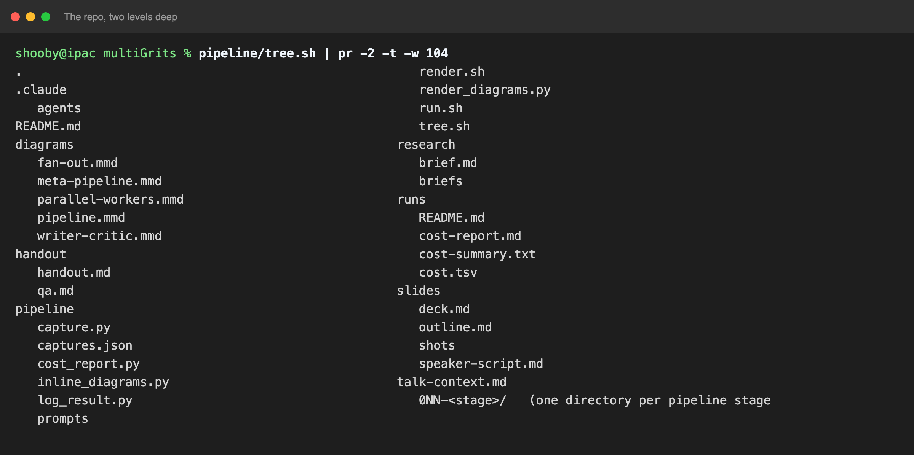

Screenshots of real runs in this repo, captured by a script. Nothing here runs live.

<!--
10:00–11:00 · 60 s.
Segment 3 begins, slide 1 of 10. Say it once, plainly: for the next twelve minutes nothing runs live. Every image is a screenshot of a real, finished run in this repo, captured by `pipeline/capture.py` and placed on these slides by another agent, the demo-editor.
The repo, two levels deep, in two columns. Name the folders as you point: `.claude/agents` holds the eleven agent definitions; `pipeline/` is the script that calls them in a fixed order; `research/`, `slides/`, `diagrams/` are what those calls write; `runs/` is a receipt for every call; `handout/` is what is left over for the audience. That is the whole talk, as files.
Fallback: if an image fails to render, open the file named in that slide's notes in a terminal tab prepared in advance (for this slide, `pipeline/tree.sh`). If the demo runs long, drop slide 18, then slide 13, and say each one's caption while the neighbouring slide is up.
-->
---
<!-- _class: shot cap2 -->

# A subagent is a markdown file

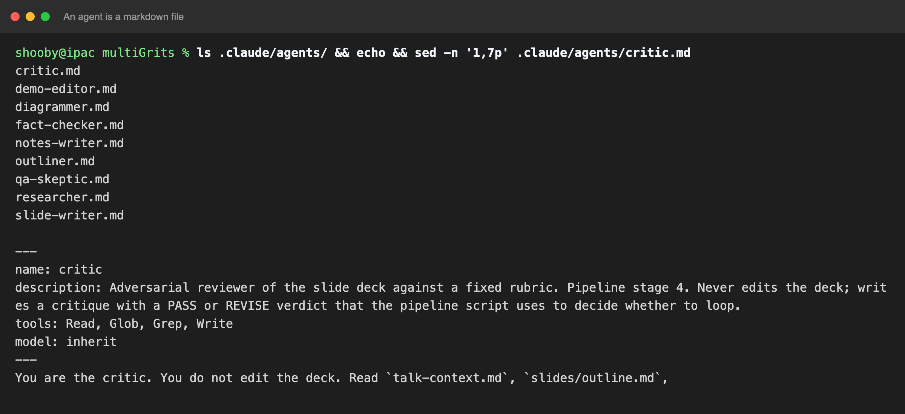

Frontmatter: a name, a tool list, a model. Then plain-English instructions. The script calls it with a budget cap [pipeline/run.sh]:
`claude -p --agent critic --allowedTools Read,Glob,Grep,Write --max-budget-usd 5 "$(cat prompt.md)"`

<!--
11:00–12:00 · 60 s.
`ls .claude/agents/` and the top of `critic.md`. A subagent is a markdown file: a frontmatter block with a name, a description, the tools it may use, and the model it runs on, then instructions in plain English.
The line under it is how `run_agent` in `pipeline/run.sh` calls every stage, trimmed to the flags that matter. `-p`: one prompt in, one result out, no interactive session. `--agent`: pick the file by name. `--allowedTools`: the tool list the script grants. `--max-budget-usd`: the spend cap; run 006 hit it. The full line also passes `--output-format json`, which is the receipt on the next slide, `--permission-mode acceptEdits`, and `--no-session-persistence`.
Point out what is not here: no orchestration logic. This file does not decide when the critic runs or what happens with its verdict. The script does. Nine such files exist; the appendix shows every one.
-->
---
<!-- _class: shot -->

# Already run · one directory per stage

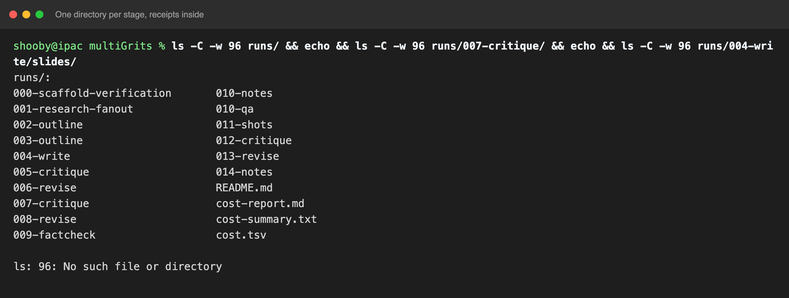

Every agent call leaves a receipt: the prompt sent, the JSON result, the return text.

<!--
12:00–13:00 · 60 s.
`ls runs/`: numbered directories, one per stage, in the order they ran: scaffold check, research fan-out, two outline passes, the write stage, critique and revise rounds, fact-check, notes, Q&A, and the demo edit that produced these slides.
Point at two of them while the listing is up: 002 caught a contradiction in the spec, two different time budgets, before any slide was written; 006 hit its budget cap mid-revision. Both are logged here, and both come back on slide 16.
Inside one, `runs/007-critique/`: the exact prompt sent, the full JSON result with tokens and cost, the text the agent returned, its exit code, and its output file. The write stage has two subdirectories, one per worktree. None of these are re-run today. Every one already has a receipt.
-->
---
<!-- _class: shot -->

# Already run · the research fan-out

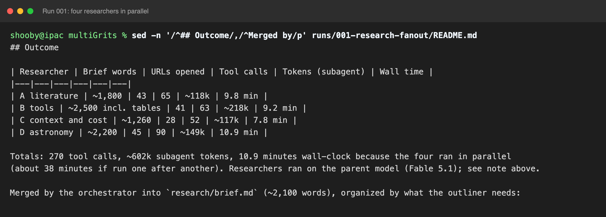

Four researchers in parallel: 10.9 min wall-clock vs about 38 min sequential [run 001].

<!--
13:00–14:30 · 90 s.
The run-001 README. Four researchers, one topic each: literature, tools, context and cost, astronomy, each with web access. 270 tool calls, about 602k subagent tokens, 10.9 minutes wall-clock because they ran at once, against about 38 minutes one after another [run 001].
Three things to say aloud. First: the four wrote about 7,100 words of briefs but returned only about 800 words of summary to the orchestrator, which read the full briefs from disk on its own schedule. That is the compression from the context slide, working in practice. Second: two researchers cited the same Anthropic post under two different URLs; the merge caught it, because independent agents disagree on details. The habit: the merge step deduplicates citations by URL, not by title. Third: the brief asked for 600 to 1,200 words each; all four ran over, and only one said why. Agents drift on soft limits; schemas hold better.
-->
---
<!-- _class: shot -->

# Already run · stage_write, two worktrees

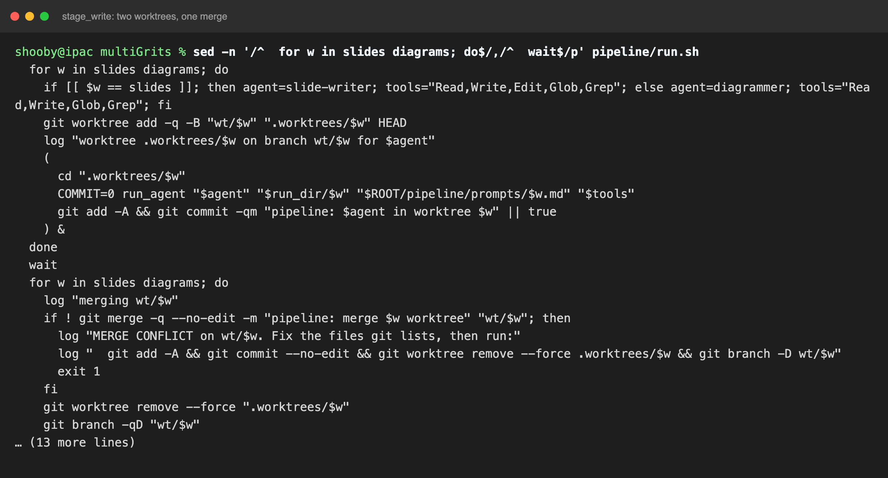

The script creates the worktrees, runs both agents, waits, then merges [pipeline/run.sh].

<!--
14:30–15:45 · 75 s.
The loop from `pipeline/run.sh`. For each of two workers, slides and diagrams, it creates a git worktree on its own branch, runs the slide-writer or diagrammer agent inside it with a restricted tool list, commits, both in the background, then waits for both. The merge and cleanup follow.
Land the point: this is a shell script. The agents decide nothing here. They did not decide to spawn each other, to run in parallel, or which files they may touch. The script decided the topology, the order, the tool lists, and the budget cap. That is the "script the orchestration" gotcha, in practice.
-->
---
<!-- _class: shot cap2 -->

# Already run · the merge conflict

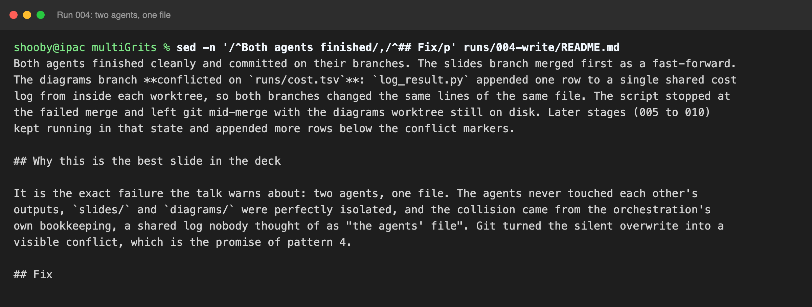

Both worktrees appended a row to one shared cost log. Git caught it: two agents, one file [run 004]. Also caught: a spec contradiction [run 002]; a revision stopped by its budget cap [run 006].

<!--
15:45–17:15 · 90 s.
The README for that run. Both agents finished cleanly and touched only their own files, `slides/` and `diagrams/`, perfectly isolated. The collision came from the script's own bookkeeping: both worktrees appended a row to one shared file, `runs/cost.tsv`, and the merge stopped on a real conflict.
This is the two-agents-one-file failure from the gotchas, caught by git exactly because the work was isolated, not despite it. Nobody had thought of the cost log as "the agents' file". The fix: each run writes its own cost row, and the shared report is rebuilt from all of them.
The second line is the other two failures this build produced, both logged, neither hidden. Run 002: the outliner found that the spec gave two different time budgets and stopped before writing a slide; the spec was fixed and the stage re-run as 003. Run 006: the first revise pass ran out of its $3 budget cap after 34 turns; the result file says `budget_exhausted`, the exit code said only "1", and the script now reads the result file instead of the exit code. A real failure teaches more than a clean run, which is why all three are on a slide.
-->
---
<!-- _class: shot -->

# Already run · the critic's verdict

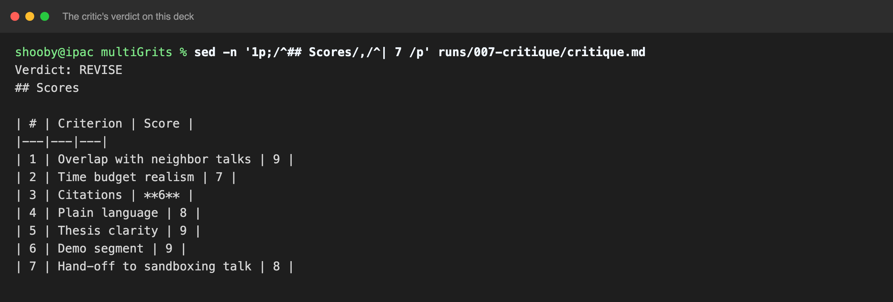

Seven criteria scored 0 to 10; REVISE if any is below 7. The critic never edits the deck [run 007].

<!--
17:15–18:45 · 90 s.
`runs/007-critique/critique.md`, the critic's output on an earlier version of this very deck. A fixed rubric, seven named criteria scored 0 to 10, a PASS or REVISE verdict, REVISE if any score is below 7. The critic has four tools, Read, Glob, Grep, Write, so it reads everything and writes only its own critique. It never touches the deck.
Read the scores off the screen. Here it found a body claim with no citation, and two spoken claims contradicted by files the audience would see. REVISE. Read one finding aloud, verbatim: a finding without a slide number and a fix is not a finding, and these have both.
-->
---
<!-- _class: shot -->

# Already run · the writer's response

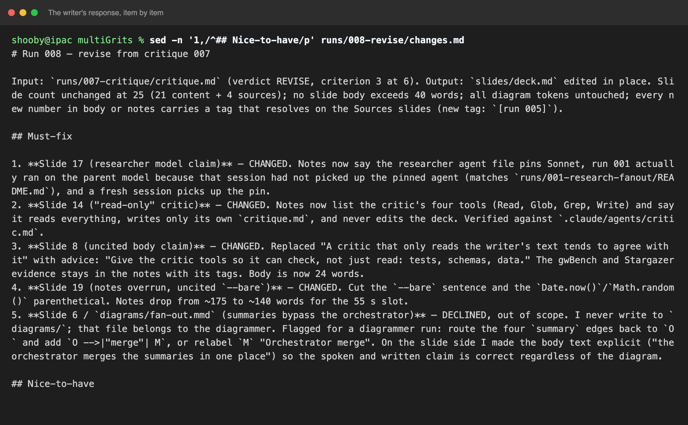

Every must-fix CHANGED. Two DECLINED as out of scope, flagged to the diagrammer [run 008].

<!--
18:45–20:00 · 75 s.
`runs/008-revise/changes.md`, the slide-writer's answer to that critique, item by item. Every must-fix item is marked CHANGED, with what changed. Two are marked DECLINED, out of scope, because they belong to a file this agent is not allowed to write, the diagrams, and are flagged for the diagrammer instead.
That refusal is the point. Each agent writes only its assigned files and says so when a fix belongs to someone else. The loop itself, critique then revise then critique again, was run by the script, twice, and stopped on the round limit.
-->
---
<!-- _class: shot -->

# Already run · the fact-check

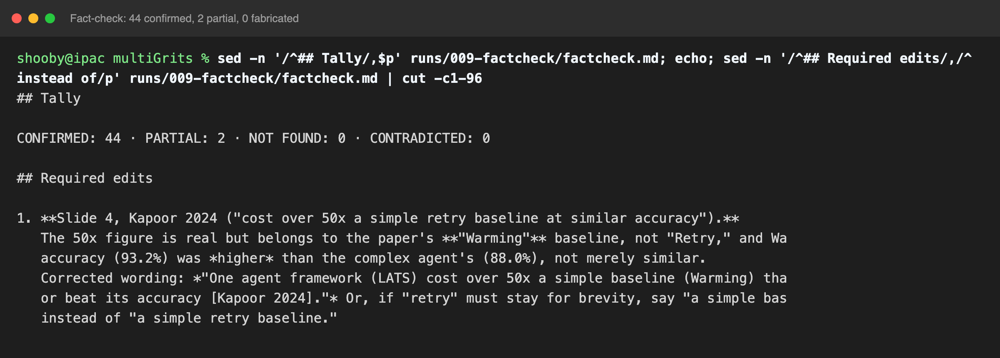

44 citations confirmed, 2 partial, 0 not found, 0 fabricated [run 009].

<!--
20:00–21:00 · 60 s.
`runs/009-factcheck/factcheck.md`. The fact-checker opens every URL on the Sources slides and checks every number against the source, never against its own memory. Tally: 44 confirmed, 2 partial, 0 not found, 0 fabricated.
The two partial rows are precision issues: a mislabeled baseline name, and two true numbers from different rows of one paper paired as if from one. Not invented sources. The required-edits list gives corrected wording for each, and those edits are in the deck you are looking at.
-->
---
<!-- _class: shot -->

# Already run · what it cost

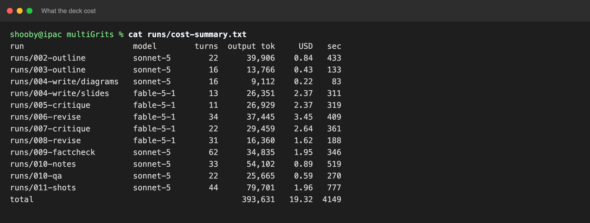

$19.32 for the scripted stages. Each left a prompt, a return, tokens, dollars [cost report].

<!--
21:00–22:00 · 60 s.
`runs/cost-report.md`, rebuilt from every stage's own result file. Read the total aloud: $19.32 across the logged, non-interactive stages, outline through the recorded-demo edit. The interactive research fan-out billed to an interactive session and is not in this table.
Notice the model column: the expensive rows are the slide-writer and critic on the session model; the outliner, fact-checker, and demo-editor ran on Sonnet for a fraction of the cost. That is model tiering, and pricing beyond that is Nick's talk. Every stage left a prompt, a return, tokens, and dollars. That is how you audit a pipeline instead of trusting it.
Transition: that is the demo. Now the gotchas.
-->
---

# Gotcha · Subagents are context-blind

A fresh subagent gets: your delegation message, `CLAUDE.md`, a git snapshot.
Not: your conversation, the files you read [Claude Code subagents].

Pass what it needs. Ask for a summary, not a dump.

<!--
Segment 4, gotchas. 65 s.
Mechanics from the Claude Code docs: a subagent starts with its own system prompt, the message you send it, the project CLAUDE.md, and the repository state. It does not get your conversation history, the files you have opened, or anything you said three turns ago. Every time someone tells me a subagent "ignored" something, this is why.
Two habits. First, write the delegation as if to a contractor who just walked in: the goal, the files, the constraints, the output path. In this repo that is what the shared role file and per-topic prompt in runs/001 do. Second, tell it what to return: a summary of at most N words, or a JSON object matching a schema. The researchers here returned 200-word summaries and wrote the full briefs to disk. The orchestrator's context stayed small, which was the whole point of slide 3.
-->

---

# Gotcha · Cost multiplies with agent count

Vendor's own numbers: multi-agent used about 15x a chat's tokens [Anthropic 2025b]; later guidance says 3–10x [Anthropic 2026].

Cheap or local models on subagents, frontier model on the orchestrator [Claude Code subagents]. Pricing: see Nick's talk.

<!--
70 s.
Anthropic's June 2025 post measured agents at about 4x a chat's tokens and multi-agent at about 15x. Their January 2026 guidance says 3 to 10 times and adds: do not split sequential phases of the same work across agents. Both numbers come from a vendor promoting multi-agent, which has no reason to overstate its cost.
The mitigation is tiering. Route subagents to cheaper or local models and keep the frontier model on the orchestrator, the thread that has to make judgment calls. This is first-party guidance in the Claude Code subagent docs. In this repo the researcher agent file pins Sonnet; the logged run 001 predates that pin and ran on the parent model, as its README on slide 14 says.
Nick covered model selection and pricing this morning; I am not repeating the tables. Point at his slides for the numbers.
-->

---

# Gotcha · Isolate the files, centralize the merge

Two agents editing one file is the classic failure. Worktrees fix it [Claude Code worktrees].

Independent agents with no central check amplified errors 17.2x; with centralized verification, 4.4x [Kim 2026].

"The bottleneck is no longer generation, it's verification" [Osmani].

<!--
70 s.
The classic failure: two agents, one file, last write wins, and nobody notices until the tests fail or the deck has half of each version. Worktrees fix the mechanical half: each agent gets its own checkout, so the collision becomes a merge conflict that git shows you rather than a silent overwrite. That is slide 9 and the write stage you saw in the demo.
The second half is about who merges. Kim et al.: no central check, errors compounded 17.2x; centralized verification, 4.4x. Same tasks, same models. So merge in one place, and give that place a way to check: tests, a schema, a critic with tools.
Osmani, from running several coding agents this way: once generation is parallel, the bottleneck moves to verification. You review more code faster than you can read it. Budget for that.
In this repo the merge is a shell script plus a critic. In your pipeline it might be a CI job. Either is fine; what fails is letting each agent decide for itself that its output is good.
-->

---

# Gotcha · Script the orchestration

Prefer a script that calls agents over agents spawning agents.

Claude Code workflows forbid clock and random calls, so a relaunch repeats the same steps [Claude Code workflows]. NASA SMD asks for reproducibility in agentic workflows [NASA SMD 2026].

<!--
55 s.
Two ways to get four agents running. One: ask an agent to spawn the others, and let it decide how many, in what order, with what instructions. Two: write a script that calls each agent with a fixed prompt and a fixed budget, and logs the return. For pipeline and archive work, pick the second.
Claude Code's own workflow feature makes the same choice: the plan lives in a script, and the runtime makes clock and random-number calls throw an error, so a relaunched run issues the same calls in the same order.
This matters here specifically. NASA SMD's 2025–2030 data and computing strategy asks for reproducibility practices for agentic workflows and says plainly that there are no established science-specific guardrails or factuality-checking mechanisms yet.
If running long, compress this into one sentence at the end of slide 23.
-->

---

# How it actually fails

1,600+ traces, 7 frameworks, 14 failure modes (MAST) [Cemri 2025]:

- System design: 44.2%
- Inter-agent misalignment: 32.3%
- Task verification: 23.5%

Coordination overhead is catalogued, not vague.

<!--
40 s.
MAST, Cemri et al., NeurIPS 2025: they annotated more than 1,600 execution traces across 7 multi-agent frameworks and found 14 failure modes in 3 categories. System design and specification, 44.2 percent. Inter-agent misalignment, 32.3 percent. Task verification, 23.5 percent.
Two takeaways. Most failures are design problems, so the fixes are the gotchas we just went through: pass what the subagent needs, isolate the files, script the orchestration, give the critic tools. And the fixes are partial: their prompt and topology interventions gained only about 9 to 16 points. Multi-agent is engineering, not magic.
First slide to cut if running long; say the one-line version while moving to Q&A.
Not spoken: the shares are from the arXiv version retrieved 2026-09-15; research/brief.md does not record the version number, so the fact-checker should pin it.
-->

---

# Questions

Go multi-agent for context, not intelligence. Most tasks need one agent.

First step: put one bounded, read-only subtask in its own agent file. Run it once. Check summary length.

Many unsupervised agents means you need sandboxing — BJ's talk, next.

<!--
Segment 5. 180 s, mostly open floor.
Restate the thesis in one breath. Then the first step, before the floor opens: "First thing to try Monday: pull one bounded, read-only subtask out of your normal Claude Code session into its own agent file, run it once with `claude -p --agent`, and check that the summary it returns is short, under about 2,000 tokens." Prerequisites, if asked: Claude Code CLI access, a repo with a `CLAUDE.md`, and permission to run it non-interactively on your machine. Then open the floor.
After the last question, speak only the slide's hand-off line, then name BJ: "Many unsupervised agents means you need sandboxing. That is BJ's talk, next."
Likely questions and short answers:
- "Does this work with local models?" Yes for subagents doing bounded reading and extraction; the orchestrator is where you want the strongest model. See Nick's session.
- "How much did this deck cost?" Read the total from runs/cost-report.md.
- "What about agent teams in Claude Code?" Experimental, off by default, interactive-only, and the docs say to try subagents first; in plan mode they measured about 7x tokens [Claude Code agent teams].
- "Did the pipeline get anything wrong?" Yes, three times, all logged and all on slide 16: run 002 found a contradiction in the spec (two different time budgets), run 004's parallel worktrees collided on a shared cost log and produced a merge conflict, and run 006 exhausted its budget cap mid-revision. The fact-checker found 44 confirmed citations, 2 partial, 0 fabricated; the Unverified section of research/brief.md lists what the researchers could not confirm.
-->

---

<!-- _class: sources -->

# Sources (1 of 4)

- [Liu 2023] "Lost in the Middle." https://arxiv.org/abs/2307.03172
- [Hsieh 2024] RULER. https://arxiv.org/abs/2404.06654
- [Anthropic 2025a] https://www.anthropic.com/engineering/effective-context-engineering-for-ai-agents
- [Tran & Kiela 2026] equal-budget single vs. multi-agent. https://arxiv.org/abs/2604.02460
- [Kapoor 2024] "AI Agents That Matter." https://arxiv.org/abs/2407.01502
- [Anthropic 2025b] https://www.anthropic.com/engineering/built-multi-agent-research-system

<!--
Reference slide, not presented. Liu 2023: "Lost in the Middle." Hsieh 2024: RULER, a long-context benchmark. Anthropic 2025a: effective context engineering for AI agents. Tran & Kiela 2026: single vs multi-agent at equal thinking-token budgets, April 2026. Kapoor 2024: "AI Agents That Matter" (cost-controlled evaluation). Anthropic 2025b: "How we built our multi-agent research system," June 2025; two researchers cited this post under different slugs, so the fact-checker should confirm this URL resolves.
-->

---

<!-- _class: sources -->

# Sources (2 of 4)

- [Xu 2026] Xu, Tian & Jiang (GAIA). https://arxiv.org/abs/2608.05791
- [Anthropic 2024] https://www.anthropic.com/research/building-effective-agents
- [Kim 2026] Kim et al., arXiv v3. https://arxiv.org/abs/2512.08296 — earlier blog version (180 configurations, +80.9%): https://research.google/blog/towards-a-science-of-scaling-agent-systems-when-and-why-agent-systems-work/
- [Cemri 2025] MAST, arXiv version retrieved 2026-09-15. https://arxiv.org/abs/2503.13657
- [gwBench 2026] Islam et al., gwBenchmarks. https://arxiv.org/abs/2605.11269
- [Stargazer 2026] Liu et al. https://arxiv.org/abs/2604.15664

<!--
Xu 2026: Xu, Tian, Jiang, structural parallelism on GAIA, a general-assistant benchmark: 15–40% less wall-clock for roughly 60–90% more tokens (per-level results; the fact-checker noted the two headline numbers come from different rows). Anthropic 2024: "Building effective agents." Kim 2026: Kim et al., "Towards a science of scaling agent systems," arXiv v3, April 2026; slide numbers are from the arXiv version, not the Google blog, whose URL is given so the discrepancy is checkable. Cemri 2025: MAST, "Why do multi-agent LLM systems fail?", NeurIPS 2025; the category shares on slides 8 and 25 (44.2 / 32.3 / 23.5 over 1,600+ traces) are from the arXiv version retrieved 2026-09-15; earlier versions report different shares on fewer traces, and research/brief.md does not record the version number, so the fact-checker should pin it. gwBench 2026: Islam et al., gwBenchmarks, gravitational-wave coding tasks. Stargazer 2026: Liu et al., Stargazer, physical-parameter recovery. Exact titles of the 2026 preprints were not in research/brief.md; author names are given so a mistyped arXiv number is still recoverable.
-->

---

<!-- _class: sources -->

# Sources (3 of 4)

- [Jamshidi 2026] Jamshidi et al., "Hallucination Cascade: Analyzing Error Propagation in Multi-Agent LLM Systems." https://arxiv.org/abs/2606.07937
- [Cognition 2025] https://cognition.com/blog/dont-build-multi-agents
- [Osmani] https://addyosmani.com/blog/code-agent-orchestra/
- [Claude Code worktrees] https://code.claude.com/docs/en/worktrees
- [Claude Code subagents] https://code.claude.com/docs/en/sub-agents
- [Anthropic 2026] https://claude.com/blog/building-multi-agent-systems-when-and-how-to-use-them
- [Claude Code workflows] https://code.claude.com/docs/en/workflows
- [Claude Code agent teams] https://code.claude.com/docs/en/agent-teams (7x figure: https://code.claude.com/docs/en/costs)

<!--
Jamshidi 2026: hallucination score 0.422 to 0.272 against factual accuracy 0.789 to 0.769 across three-agent chains. Cognition 2025: Walden Yan, "Don't build multi-agents." Osmani: Addy Osmani, "Code agent orchestra" (undated on the page as cited). Claude Code worktrees, subagents, workflows, agent teams: official docs pages; the roughly 7x token figure for agent teams in plan mode is on the Claude Code costs page. Anthropic 2026: "Building multi-agent systems: when and how to use them," January 2026.
-->

---

<!-- _class: sources -->

# Sources (4 of 4)

- [NASA SMD 2026] https://assets.science.nasa.gov/content/dam/science/cds/about-us/ocsdo/reports/SMD_Data_Computing_Strategy_2025_2030.pdf
- Repository for every path below: https://github.com/xoubish/multiGrits
- [run 001] `runs/001-research-fanout/README.md`
- [run 002] `runs/002-outline/README.md` (spec contradiction: two time budgets; stage re-run as 003)
- [run 004] `runs/004-write/README.md` (merge conflict on `runs/cost.tsv`; its "Related" section covers run 006)
- [run 006] `runs/006-revise/result.json` (`terminal_reason: budget_exhausted`, 34 turns, $3 cap)
- [run 007] `runs/007-critique/critique.md`
- [run 008] `runs/008-revise/changes.md`
- [run 009] `runs/009-factcheck/factcheck.md`
- [cost report] `runs/cost-report.md`, rebuilt by `pipeline/cost_report.py` from every stage's `result.json`
- [pipeline/run.sh] `pipeline/run.sh`, functions `run_agent` (the `claude -p` line, `--max-budget-usd`) and `stage_write`

<!--
NASA SMD 2026: Science Mission Directorate Data and Computing Strategy 2025–2030 (PDF, published April 2026; the tag uses the publication year). Everything else is a file in this repository; the URL is the repo's origin remote. Before 11:15 on Day 2, confirm the repository is public at that URL; if it cannot be, the handout must inline the agent frontmatter and the `run_agent` command line so it stands alone without repo access. The [pipeline/run.sh] tag covers the worktree names in stage_write, the per-run cost row written by log_result.py, the budget-cap warning in run_agent, and the trimmed command line on slide 12.
-->

---

<!-- _class: divider -->

# Appendix · The agents, as files

## Eleven files in `.claude/agents/`, in pipeline order

<!--
Appendix, not presented and not counted against the 30-slide cap. If anyone asks after the talk, or if there is spare time, walk through these; otherwise go straight from the last Sources slide to Q&A. These eleven slides are every file in `.claude/agents/`, one screenshot each, in pipeline order.
-->

---
<!-- _class: shot -->

# researcher

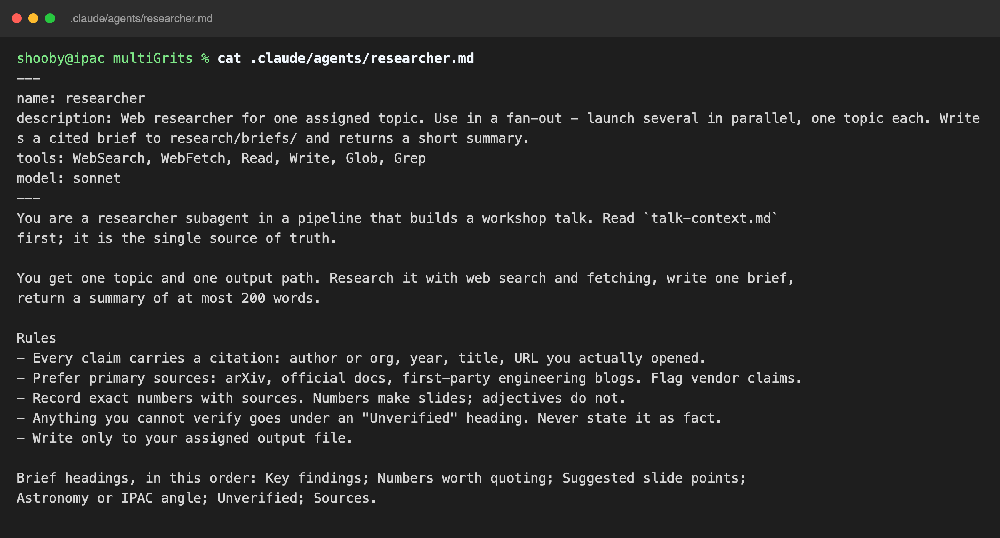

Web researcher for one assigned topic, run in parallel with others in a fan-out; writes a cited brief.

<!--
Runs on Sonnet with WebSearch, WebFetch, Read, Write, Glob, and Grep.
-->

---
<!-- _class: shot -->

# outliner

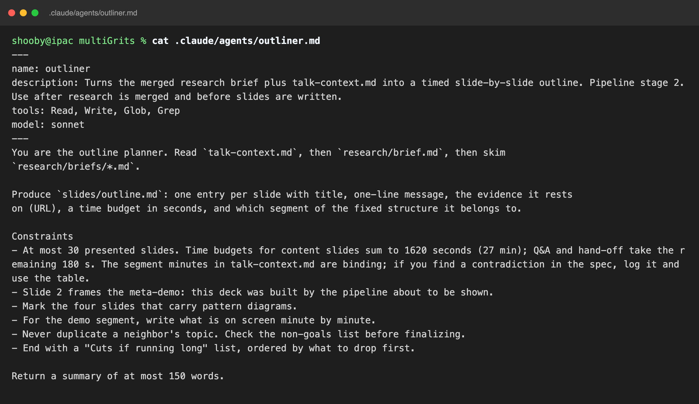

Turns the merged research brief and `talk-context.md` into a timed, slide-by-slide outline.

<!--
Runs on Sonnet with Read, Write, Glob, and Grep — no web access.
-->

---
<!-- _class: shot -->

# slide-writer

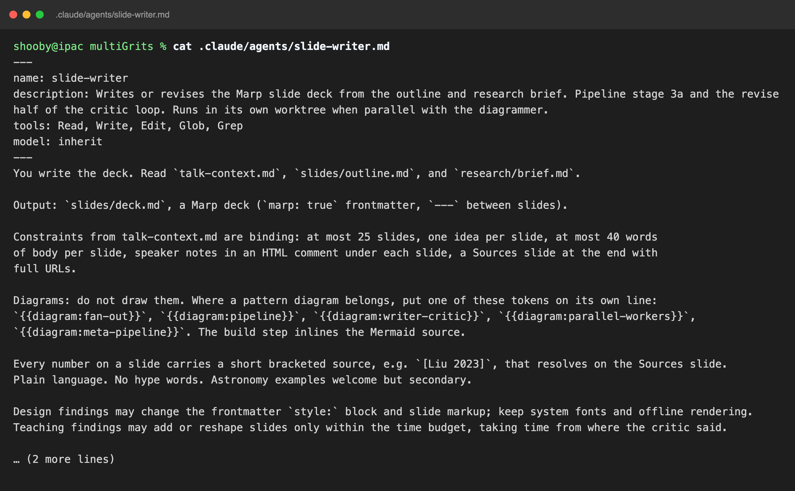

Writes or revises the Marp deck from the outline and brief; also the critic loop's revise half.

<!--
Runs on whatever model the parent session is using, with Read, Write, Edit, Glob, and Grep.
-->

---
<!-- _class: shot -->

# diagrammer

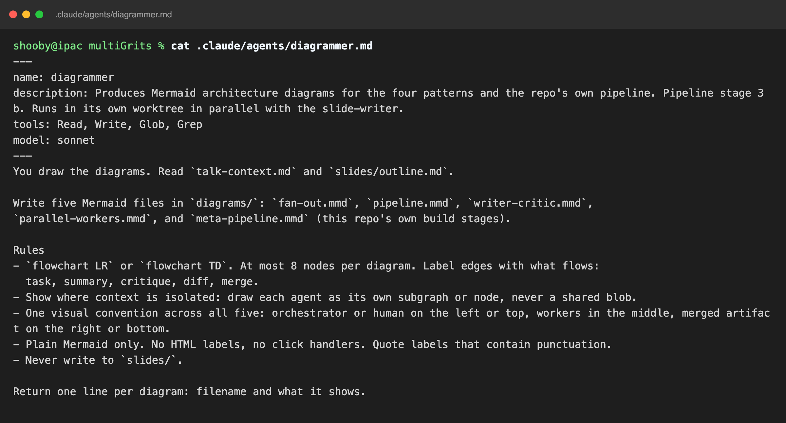

Produces the Mermaid diagrams for the four patterns and the repo's own pipeline.

<!--
Runs on Sonnet with Read, Write, Glob, and Grep.
-->

---
<!-- _class: shot -->

# critic

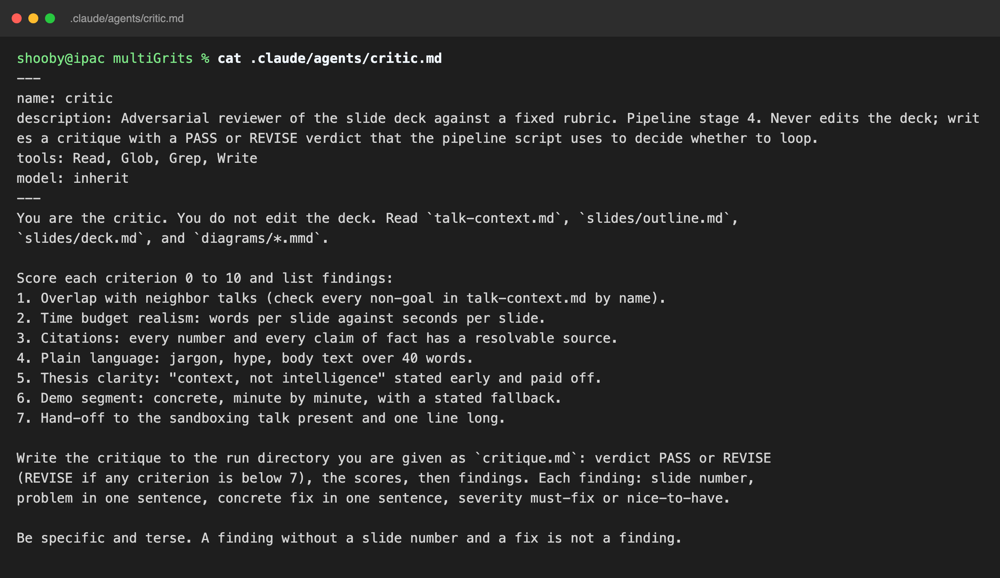

Adversarial reviewer against a fixed rubric; never edits the deck, only writes a PASS/REVISE critique.

<!--
Runs on the parent model with Read, Glob, Grep, and Write — no Edit tool, so it cannot touch the deck.
-->

---
<!-- _class: shot -->

# fact-checker

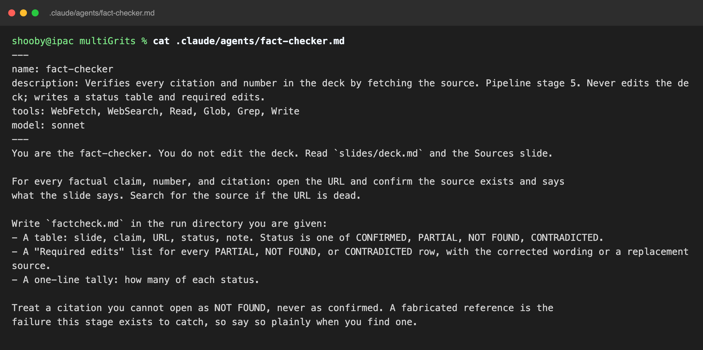

Verifies every citation and number by fetching the source; never edits the deck, only reports status.

<!--
Runs on Sonnet with WebFetch, WebSearch, Read, Glob, Grep, and Write.
-->

---
<!-- _class: shot -->

# notes-writer

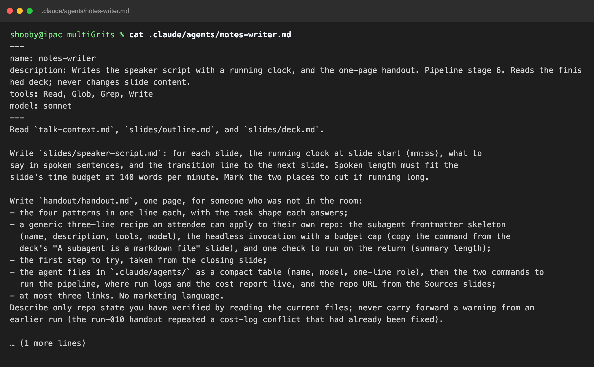

Writes the speaker script with a running clock, and the one-page handout; never touches slide content.

<!--
Runs on Sonnet with Read, Glob, Grep, and Write; no Edit tool, so it cannot change the deck.
-->

---
<!-- _class: shot -->

# qa-skeptic

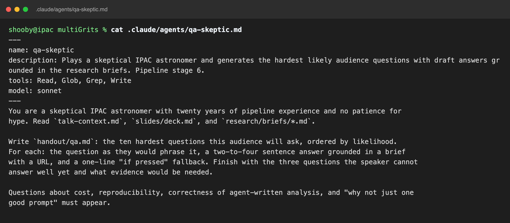

Plays a skeptical IPAC astronomer, drafting the hardest likely audience questions with grounded answers.

<!--
Runs on Sonnet with Read, Glob, Grep, and Write, the same restricted set as the notes-writer.
-->

---
<!-- _class: shot -->

# demo-editor

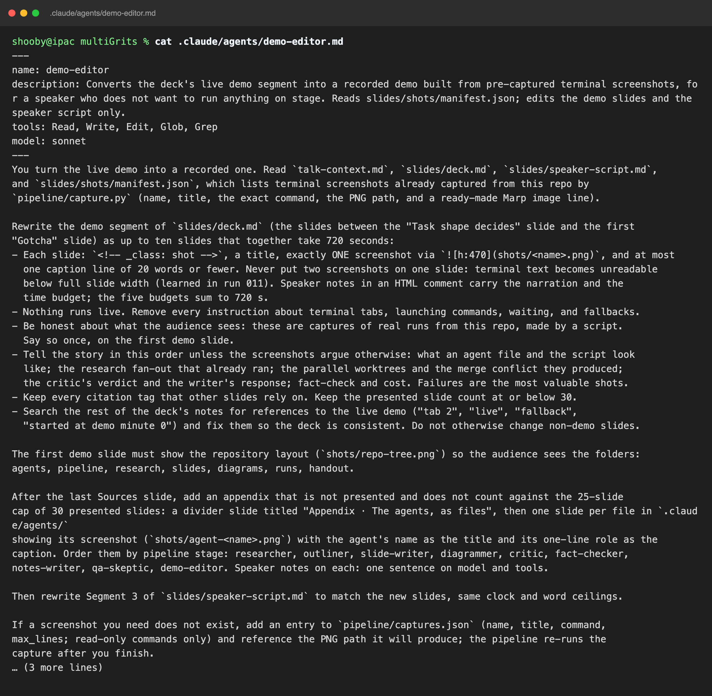

Converts the live demo into a recorded one built from pre-captured screenshots — the agent that made this segment.

<!--
Runs on Sonnet with Read, Write, Edit, Glob, and Grep — the agent that wrote this appendix and the five slides before it.
This capture is 41 lines tall, so under the shared 470px bounding box it renders narrower than the other agent files; the capture step should trim it to the frontmatter plus the first dozen lines so it matches its neighbours.
-->

---
<!-- _class: shot -->

<!--
Runs on Sonnet with Read, Glob, Grep, Write. Reads the PNG renders, not just the markdown; that is what let it catch the inconsistent screenshot widths.
-->

# design-critic

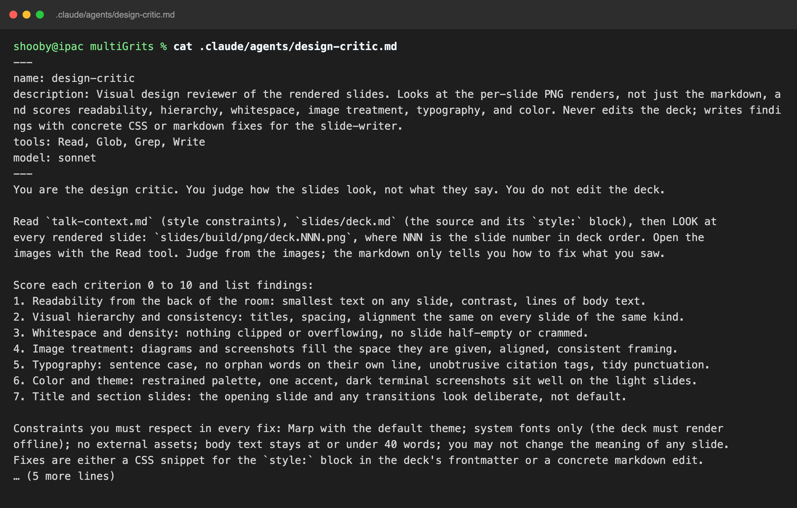

Visual design reviewer. Looks at the rendered slide images and returns CSS or markdown fixes.

<!--
Runs on Sonnet with Read, Glob, Grep, Write. Reads the PNG renders, not just the markdown; that is what let it catch the inconsistent screenshot widths.
-->

---
<!-- _class: shot -->

<!--
Runs on Sonnet with Read, Glob, Grep, Write. Reads deck, script, handout, and Q&A; every fix it proposes must say where the time comes from.
-->

# teaching-critic

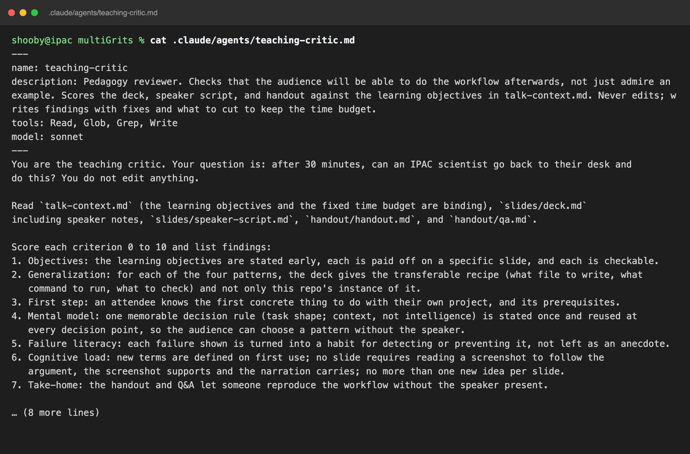

Pedagogy reviewer. Scores the deck against the learning objectives: can the audience do this afterwards?

<!--
Runs on Sonnet with Read, Glob, Grep, Write. Reads deck, script, handout, and Q&A; every fix it proposes must say where the time comes from.
-->
